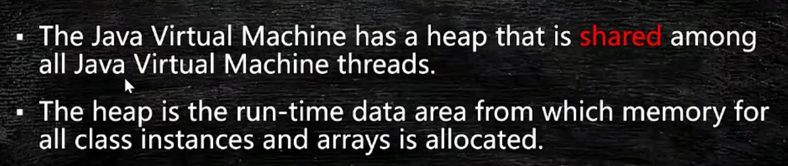
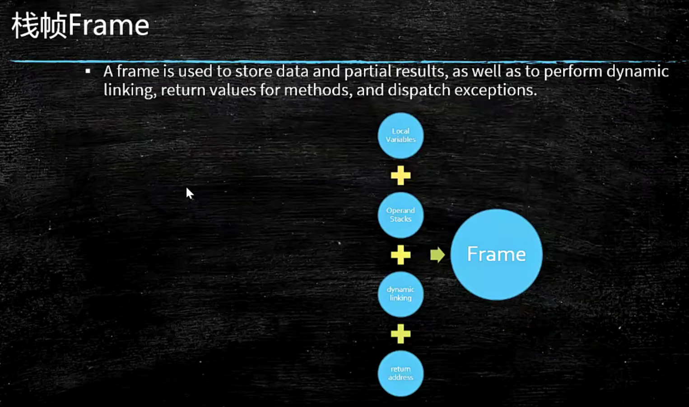
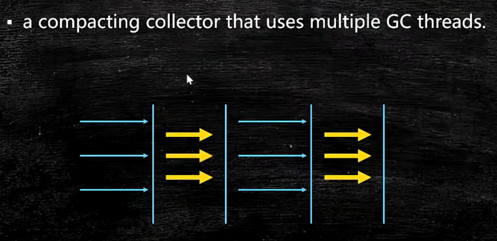

# JVM

## jvm入门

java从编码到执行的过程。我们有一个文件x.java，你执行java c。它就变会变成x.class。当我们调用JAVA命令的时候，class会被load到内存里。一般的情况下我们写自己的类文件的时候也会用到JAVA的类库，所以呢，他会把JAVA类库相关的这些个类也要装载到内存里。装载完成之后呢？会调用字节码的解释器。或者是及时编译器来进行解释，编译完之后由执行引擎开始执行，执行引擎面对的那就是操作系统和硬件了。

会有一个问题，说JAVA是这个解释执行的还是编译执行的？其实呢，解释和编译是可以混合的，特别常用的一些代码，代码用到的次数特别多，好这个时候JIT会把代码做一个即时的编译，做成一个本地的编译，就像你可以理解为就像C语言，只要在WINDOWS上执行的时候把它编译成EXE一样。那么，下次再执行这段代码的时候，就不需要通过解释器来一句一句解释来执行了，执行引擎可以直接交给操作系统去执行，让它的调用效率要高很多，不是所有的代码都要都会被JIT进行及时编译的。如果是这样的话，那整个JAVA就完全变成了不能跨平台了。


JVM我们可以称它是一个跨语言的平台，而JAVA叫跨平台的语言。目前能够在JVM上跑的语言特别多，除了JAVA之外，还有scala、kotlin等等。其实JVM本身也是一个规范。在linux上是由linux实现、WINDOWS由WINDOWS实现、mac由mac实现，它帮你屏蔽了操作系统的这些底层。


那虚拟机到底是怎么够做到这么多语言都可以在上跑呢，最关键的原因是就是因为class这个东西。我们可以说任何的语言，只要你能编译成class，符合class文件的规范，你就可以扔在JAVA虚拟机上去执行。

- jvm和java无关


jvm是一种规范。它是虚构出来的一台计算机，既然它是一个虚拟的计算机，你就可以想象成一层单独的机器，它有自己的CPU，有自己的指令集，有自己的汇编语言，我们后面会讲JAVA的汇编语言，就是字节码的指令集。它是一台虚拟的机器，它就相当于自己是一个操作系统，那自己这个操作系统内存是怎么管理的？我们后面会讲。

这里面就会涉及到编译原理的过程，源码是怎么进行词法分析、语法分析，语义分析、最后生成二进制字节码。这里涉及到编译原理，不会重点说。


JVM是一种规范，既然是一种规范，它就有具体的各种各样的实现。


JVM它只是来执行的，就是你所有东西都弄好了之后让我来执行。你直接直接把.CLASS的各种的东西全部弄好了，扔给它，它来执行，它就干这事。

jre叫java runtime environment，运行时环境。想在操作系统上运行，除了有虚拟机之外你还得有那些核心类库，例如String.class文件


## class文件格式

整个的虚拟机是以class文件为核心，今天我们来分析class文件。

下去一定要写这种特别简单的小程序来进行测试。

```
public class Code01 {
    public static void main(String[] args) {
    }
}
```

反编译。发现自动帮我们加了一个无参构造

```
public class Code01 {
    public Code01() {
    }

    public static void main(String[] args) {
    }
}
```

使用notepad可以看.class字节码文件

```
使用Notepad++查看class文件
notepad++查看class文件需要下载HEX-Editor插件
打开插件管理，搜索HEX-Editor，版本号为0.9.5
安装之后就可以查看字节码文件了。
打开要查看的class文件，按快捷键 Ctrl+Alt+Shift+H 用16进制的方法查看。
```

前面4个字节是魔数。再下来4个字节是小版本号和大版本号。

这就是这样就八个字节了。接下来就是一些常量池有关的，有两个字节代表常量池计数。接下来就是一些常量池具体的内容了。


还有别的可以查看.class字节码文件的方法。

- javap--jdk自带的
- JBE--除了可以观察，还可以修改。
- JClassLib -IDEA插件

到idea里面安装好插件JClassLib。视图里面点击`SHOW BYTECODE WITH JCLASSLIB`。如果是点击了下面的`显示字节码`，那么那个就是用javap帮你解析的


access flag--访问标志位，用两个字节就够了，用按位与运算来知道。

常量池计数有20个，但是常量池只有19个。这是因为常量池是从1开始计数的。要把0保留，标记没有任务引用的情况。

常量池里面的常量类型特别多。CONSTANT_Uft8_info是用的最多的。代表utf 8的一个字符串。

|  |  |
| ------------------------------------------------------------ | ------------------------------------------------------------ |


怎么看常量类型的类别？任意一个常量类型的都是由一个字节开头的，作为tag。然后后面对应有它这个类别应该占多少的空间，这些空间来放值、索引等等。

我们知道前八个字节是魔数和版本号。从第8列开始代表的就是常量池有关的内容了。8-9列，00 14代表常量池计数，1*16+4=20，看上面的图刚好常量池类型标号到了19，为常量池计数-1，因为0位置要留着。

看a列，是第一个常量池类型的tag，发现是10在上图中点进去查看，发现是CONSTANT_Methodref_info的tag，也与上面的相符合。后面还有两个都是2字节的索引项`00 02` 以及`00 03`，分别指向CONSTANT_Class_info和CONSTANT_NameAndType_info。看b-c列和d-e列分别是2号和3号，在下图中也得到了验证！


方法的附加属性最重要的一项是Code。而这个代码具体在最后一项attribute里面。附加属性里面最重要的一项是方法表，也就是这个方法编译完成之后的字节码指令。那么JVM看到这个指令的时候，首先会读这个指令进来，然后他根据指令去查他自己的指令表。

比如拿`aload_0`来说，只要你不是静态方法，永远他都会把这个this扔到操作数栈里，操作栈再执行第二条指令，第二条指令叫invoke special---特殊调用，调用this的构造方法。

看下面字节码。当他读到2a的时候，他知道这个指令叫aload_0。代表把this压栈。然后后面是调用下条指令b7，叫invoke special。而invoke special是需要的参数就是后面的`00 01`。`00 01`代表常量池里面的第一项是JAVA.lang.Object.，调用了他的构造方法。最后一个b1代表return。这也印证了要构造子类先构造父类！


JAVA的指令集用一个字节来代表，所以总共最多就有个256条指令

读下面的方法的字节码。你能大概读出构造过程是怎么构造的。一个对象出来之后，这个构造过程首先会调用父类的构造方法，然后才会把自己的成员变量进行初始化。

```
public class Code02 {
    int a = 888;

    public Code02() {
    }
}
```


再来看。发现变成类字段之后就不在构造方法中进行赋值了！

```java
public class Code03 {
    static int a = 888;

    public Code03() {
    }
}
```


CPU它又会把数据直接拿到它自己内部的寄存器里，速度快多了。但是像JVM的这个设计呢，它是把所有的内容都要经过栈，来进行计算和实现。


常量池后面跟两个字节是access flags，访问标记，代表你这个类前面是private还是public。

继续跟两个字节，这两个字节代表this class，当前类。常量池关键就关键在于后面的所有东西都是去引用它的，所以this class 指向常量池的类名的那个引用。

再往后两个字节是superclass。

再往后两个字节是interface count，就是我这个类到底实现了多少个接口。

后面就是一个一个的interface的引用，都是两个字节，仍然指向常量池的引用。

往后就是fields_count。以及一个一个具体的field。

往后还有methods_count。以及一个一个具体的method_info

最后一项是attribute_count。以及一个一个具体的attribute。这里面最重要的属性其实是code。

## Class Loading Linking Initializing

类的加载、初始化

### 加载过程

加载过程分为三步Loading、Linking、Initializing。

Loding就是把一个一个的class文件load到内存。

Linking还有三小步：

1. verification代表校验。校验你给我装进来的这个class文件符不符合class文件的标准。
2. preparation是最重要的一步。它把文件的静态变量赋默认值(null 0 false)，而不是赋初值，要区分开。
3. resolution意思是这个class文件里面的常量池里面用到的那些符号引用，要给他转换成为直接的内存地址。

Initializing是静态变量的赋值，这个时候才赋为初始值，才调用静态代码块。


#### 1. Loading

来看类加载器。

JVM本身有一个类加载器的层次，分别加载不同的class。jvm里面所有的class都是被类加载器给加载到内存的，ClassLoader本身也是一个类。

String.class是一个Class类的对象。当一个class文件被load到内存的时候，内存里面创建了两块内容，第一块就是class文件的具体内容。第二块就是一个String.class这样的一个Class类的对象，这个对象指向了前面创建的第一块也就是class文件的具体内容。后面我们创建的所有的String类型的对象都是先去访问String.class这个对象，通过这个对象去访问String类里面的内容。Class类的对象是c++代码在load的过程中弄出来的。Class类的对象是来帮助我们解析内存里面的二进制码class文件的。

加载过程分成不同的层次来加载，不同的加载器负责加载不同的class。

最顶层的是Bootstrap，加载的是核心类，C++实现的。如果你getClassLoader得到的是null，那么说明你到达了最顶层的类加载器了。Bootstrap它本身是JAVA虚拟机内部用C++代码实现的一个模块，在JAVA里面直接访问是没有一个class和他去直接对应的。因此当我们getClassLoader到头的时候，返回null。

接下来是扩展类加载器。

还有一个是我们自己平时在用到的类加载器，叫做APPClassLoader，他是用来加载class path指定的内容。我们自己写的class文件都是位于classpath里面，是由这个类加载器加载的。

加载器的加载器是最顶级的加载器，而不是加载器的父进来的，不要混淆！

还有自定义classLoader，后面说。

```java
public class T002_ClassLoaderLevel {
    public static void main(String[] args) {
        //核心
        System.out.println(String.class.getClassLoader());
        //核心
        System.out.println(sun.awt.HKSCS.class.getClassLoader());
        //ext
        System.out.println(sun.net.spi.nameservice.dns.DNSNameService.class.getClassLoader());
        //App
        System.out.println(T002_ClassLoaderLevel.class.getClassLoader());
        //顶级
        System.out.println(sun.net.spi.nameservice.dns.DNSNameService.class.
                         getClassLoader().getClass().getClassLoader());
        //顶级
        System.out.println(T002_ClassLoaderLevel.class.
                           getClassLoader().getClass().getClassLoader());

        System.out.println(new T006_MSBClassLoader().getParent());
        
        System.out.println(ClassLoader.getSystemClassLoader());
    }
}
```

```
null
null
sun.misc.Launcher$ExtClassLoader@677327b6
sun.misc.Launcher$AppClassLoader@18b4aac2
null
null
sun.misc.Launcher$AppClassLoader@18b4aac2
sun.misc.Launcher$AppClassLoader@18b4aac2
```


下图的父是语法上的父，也就是继承关系（extends）。但是上图说的父并不是继承关系。App/Extension这几个类加载器不是继承关系。下面这个图你完全可以忘掉。真正的去load的class文件的时候，上图的意思是说，位于下层的类加载器如果找不着，我可以委托给父加载器去找，这里的父指的是它的上级、上层，而不是指继承。


双亲委派是什么？

一个class文件需要被漏到内存的时候，执行的过程是这样的。假如你自定义了，就先尝试着去自定义Class Loader里面去找。自定义Class Loader内部维护着一个缓存，如果你需要的自定义的S类之前加载过了，那么就不需要再加载一遍了。如果没加载过，会一层层的往上去委托父亲，看看App Class Loader没有加载过，有就返回，没有就继续委托Extension Class Loader、Bootstrap Class Loader。如果到了Bootstrap Class Loader还是没有，那么Bootstrap Class Loader会往下去返回，告诉Extension Class Loader自己去加载，如果Extension Class Loader也加载不了，那么告诉App Class Loader，让它自己去加载，如果App Class Loader也找不到，那么就叫 Custom Class Loader自己去找，这个时候才去加载S类。是转一圈的过程。

如果最后Custom Class Loader成功把S类加载进来了，那么就是成功，否则抛异常，class not found 。这就是双亲委派。


大体的流程。

双亲委派指的是，有一个从子到父的过程，又有一个从父到子的过程。

为什么要有双亲委派？为啥不能直接Load到内存。主要是为了安全。因为如果Custom Class Loader可以把我们自己写的Java.lang.String这个类给Load到内存，那么就会覆盖String这个顶级的核心类，这样我们就可以用自己写的String做坏事，例如偷密码，这是不被允许的。次要问题才是资源浪费问题。

要注意区分概念，父加载器不是类加载器的加载器，这个父的意思是我们画的那个委派的层次图。Custom Class Loader委托自己的上级App Class Loader去找，App Class Loader就是Custom Class Loader的父。而类加载器的加载器是Bootstrap Class Loader去加载的。并且这里的父的意思，也不是父类extends的意思，Custom Class Loader并不是App Class Loader的子类！

从源码级别理解父加载器，其实一个 Class Loader里面有一个成员变量叫做parent，这个parent你指定谁，谁就是你的父加载器。


```java
public class T004_ParentAndChild {
    public static void main(String[] args) {
        System.out.println(T004_ParentAndChild.class.getClassLoader());//App
        System.out.println(T004_ParentAndChild.class.getClassLoader().//App
                getClass().getClassLoader());//BootStrap
        System.out.println(T004_ParentAndChild.class.getClassLoader().//App
                getParent());//Extension
        System.out.println(T004_ParentAndChild.class.getClassLoader().//App
                getParent().//Extension
                getParent());//BootStrap
    }
}
```

输出：

一个对象的的toString方法，它默认显示类的名字+Hashcode。所以这个类的名字是sun.misc.Launcher$AppClassLoader，也就是说AppClassLoader是Launcher的一个内部类。Launcher其实就是AppClassLoader的一个包装类，一个启动类。看Launcher的源码你会发现，APP、BootStrap、Extension加载器加载的路径都在里面写死了。

```
sun.misc.Launcher$AppClassLoader@18b4aac2
null
sun.misc.Launcher$ExtClassLoader@1b6d3586
null
```


下面看怎么自定义类类加载器。

你要加载一个类很简单，你只需要调用class loader的load class方法就能够把这个类加载到内存，与此同时，生成一个Class类的对象，把这个class对象返回给你。所以class loader能帮你干很多事情，能够帮你去加载各种各样的东西，例如图片资源。

- 和反射的联系：class loader是反射的一个基石，你平时用的所谓的反射，无非就是你用class类的这个对象去访问二进制代码

- 什么时候我们需要去加载一个类？springmvc会把某一个Class给你生成一个动态代理，这个动态代理是一个新的Class。当你要用的时候，实际上spring偷偷的把这个新的class给你load到内存了。

  以及还有热部署，怎么热替换？我肯定需要一个class loader把这个新的Class手动的Load到内存里面去

```java
Class clazz = T005_LoadClassByHand.class.getClassLoader().//拿到AppClassLoader
    loadClass("com.mashibing.jvm.c2_classloader.T002_ClassLoaderLevel");
```

接下来看看.loadClass()方法核心的执行逻辑。可以看到先检查是不是已经Load进来了，如果没有load进来，加锁去load。先调用父亲的loadClass方法，类似一个递归的调用，回想双亲委派的过程。接着往下，也就是去父加载器找完了，看看是不是找到了，如果没有找到，那么就只能自己亲自去找了，自己找，这里调用了findClass(name)。这里相当于没有实现，意思就是如果我的Bootstrap Class Loader、App Class Loader、Custom Class Loader都没有找到，来到这段代码了，直接抛异常。所以如果我们要写自定义的类加载器，我们就自己去实现这个方法。

- 双亲委派机制体现在代码loadClass中。要打破这个机制只能自己重写loadClass方法。例如tomcat，启动了多个Application里面可能有不同版本的类，如果不自己实现，那么系统load过一次，不会再load第二次了。重写了之后就可以跳过检查缓存，可以实现热部署。tomcat具体就是把原本的classLoader干掉。

这个设计模式是钩子函数模板方法。

```java
protected Class<?> findClass(String name) throws ClassNotFoundException {
    throw new ClassNotFoundException(name);
}
```

```java
protected Class<?> loadClass(String name, boolean resolve)
    throws ClassNotFoundException
{
    synchronized (getClassLoadingLock(name)) {
        // First, check if the class has already been loaded
        Class<?> c = findLoadedClass(name);
        if (c == null) {
            long t0 = System.nanoTime();
            try {
                if (parent != null) {
                    c = parent.loadClass(name, false);
                } else {
                    c = findBootstrapClassOrNull(name);
                }
            } catch (ClassNotFoundException e) {
                // ClassNotFoundException thrown if class not found
                // from the non-null parent class loader
            }

            if (c == null) {
                // If still not found, then invoke findClass in order
                // to find the class.
                long t1 = System.nanoTime();
                c = findClass(name);

                // this is the defining class loader; record the stats
                sun.misc.PerfCounter.getParentDelegationTime().addTime(t1 - t0);
                sun.misc.PerfCounter.getFindClassTime().addElapsedTimeFrom(t1);
                sun.misc.PerfCounter.getFindClasses().increment();
            }
        }
        if (resolve) {
            resolveClass(c);
        }
        return c;
    }
}
```

所以如果我们需要自定义Class Loader，我们只需要继承ClassLoader，然后定义自己的findCLass方法即可。


具体像下面这样重写findClass方法。defineClass是一个自带的方法，直接用，可以把你读进来的字节数组转化为一个Class。

如果重写构造方法，调用父亲的构造方法就可以指定自定义类加载器了。没有指定默认就是APP类加载器。

```java
public class T006_MSBClassLoader extends ClassLoader {

    @Override
    protected Class<?> findClass(String name) throws ClassNotFoundException {
        File f = new File("c:/test/", name.replace(".", "/").concat(".class"));
        try {
            FileInputStream fis = new FileInputStream(f);
            ByteArrayOutputStream baos = new ByteArrayOutputStream();
            int b = 0;

            while ((b=fis.read()) !=0) {
                baos.write(b);
            }

            byte[] bytes = baos.toByteArray();
            baos.close();
            fis.close();//可以写的更加严谨

            return defineClass(name, bytes, 0, bytes.length);
        } catch (Exception e) {
            e.printStackTrace();
        }
        return super.findClass(name); //throws ClassNotFoundException
    }

    public static void main(String[] args) throws Exception {
        ClassLoader l = new T006_MSBClassLoader();
        Class clazz = l.loadClass("com.mashibing.jvm.Hello");
        Class clazz1 = l.loadClass("com.mashibing.jvm.Hello");

        System.out.println(clazz == clazz1);

        Hello h = (Hello)clazz.newInstance();
        h.m();

        System.out.println(l.getClass().getClassLoader());
        System.out.println(l.getParent());

        System.out.println(getSystemClassLoader());
    }
}
```

大家知道的java代码文件很容易就被反编译了。我不想让别人反编译，我就可以定义自己的格式，定义自己的ClassLoader，把一个加密过的class文件读进来，然后自己去解密。别人没有你这个ClassLoader，是没有办法解密的。

再来看懒初始化、懒加载。多数的jvm虚拟机的实现都是用的懒加载，意思就是什么时候需要这个类的时候我才去加载。


验证上面的。只有加载了才会在Initializing的时候执行静态语句块。

```JAVA
public class T008_LazyLoading { //严格讲应该叫lazy initialzing，因为java虚拟机规范并没有严格规定什么时候必须loading,但严格规定了什么时候initialzing
    public static void main(String[] args) throws Exception {
//        P p;//不会打印，我没有new，不会加载
//        X x = new X();//P是X的父类，x new了，所以X被加载，那么P作为父类也会加载
//        System.out.println(P.i);//final，不需要加载
//        System.out.println(P.j);//需要加载
//        Class.forName("com.mashibing.jvm.c2_classloader.T008_LazyLoading$P");//需要加载

    }

    public static class P {
        final static int i = 8;
        static int j = 9;
        static {
            System.out.println("P");
        }
    }

    public static class X extends P {
        static {
            System.out.println("X");
        }
    }
}
```

来看编译的问题。

JAVA是解释执行的。一个class文件load到内存之后它通过JAVA的解释器来执行。JAVA其实有一个JIT，just in time compiler。指的是有某些代码我需要把它编译成为本地代码，相当于是.EXE的。java是一种混合模式，使用解释器，再加上热点代码编译，这两种方式同时进行。热点代码是什么？意思就是虚拟机一开始都是解释执行，但是后面发现这段代码就是一个普通的循环，而且使用频率特别高，就会把它编译称为本地代码。

那为什么不直接全部变成本地代码呢？因为java解释器现在效率也很高了，在一些简单代码的执行上，它并不输于你编译成本地代码。第二，如果你一个执行的文件特别特别多，各种各样的类好几十个，你如果是变成本地代码，那么你启动会很慢。


Loding分为下面的五个小步骤。


1. 双亲委派，主要出于安全来考虑

2. LazyLoading 五种情况

   1. –new getstatic putstatic invokestatic指令，访问final变量除外

      –java.lang.reflect对类进行反射调用时

      –初始化子类的时候，父类首先初始化

      –虚拟机启动时，被执行的主类必须初始化

      –动态语言支持java.lang.invoke.MethodHandle解析的结果为REF_getstatic REF_putstatic REF_invokestatic的方法句柄时，该类必须初始化

3. ClassLoader的源码

   1. findInCache -> parent.loadClass -> findClass()

4. 自定义类加载器

   1. extends ClassLoader
   2. overwrite findClass() -> defineClass(byte[] -> Class clazz)
   3. 加密
   4. <font color=red>第一节课遗留问题：parent是如何指定的，打破双亲委派，学生问题桌面图片</font>
      1. 用super(parent)指定
      2. 双亲委派的打破
         1. 如何打破：重写loadClass（）
         2. 何时打破过？
            1. JDK1.2之前，自定义ClassLoader都必须重写loadClass()
            2. ThreadContextClassLoader可以实现基础类调用实现类代码，通过thread.setContextClassLoader指定
            3. 热启动，热部署
               1. osgi tomcat 都有自己的模块指定classloader（可以加载同一类库的不同版本）

5. 混合执行 编译执行 解释执行

   1. 检测热点代码：-XX:CompileThreshold = 10000

#### 2. Linking 

上面把loading说了，下面来看linking。

1. Verification

   1. 验证文件是否符合JVM规定

2. Preparation

   1. 静态成员变量赋默认值

3. Resolution

   1. 将类、方法、属性等符号引用解析为直接引用
      常量池中的各种符号引用解析为指针、偏移量等内存地址的直接引用

      `loadClass(String name, boolean resolve)`参数就是问你要不要解析

resolution到底是解决什么问题，它会把类方法，属性，符号引用解析为直接引用。什么叫符号引用，class文件在它的常量池里放着一个一个的类的名字，例如java.lang.object，当我们要用Object的时候，实际上是用一个符号引用x指向java.lang.object，然后java.lang.object指向在内存的实际位置。所谓的解析过程就是把这个符号引用直接转换成为指向内存的具体的地址指针的这个过程。不需要中途经过java.lang.object了。


看下面代码。其实就是考initializing，initializing会把静态代码块依次执行。如果new T在前面，会把默认值为0的count ，count变为1，然后count才被赋值为2，打印2。如果两个调换顺序，那么count先被初始化为2之后才++。那么打印的就是3。

```JAVA
public class T001_ClassLoadingProcedure {
    public static void main(String[] args) {
        System.out.println(T.count);
    }
}

class T {
    public static T t = new T(); // null
    public static int count = 2; //0

    //private int m = 8;

    private T() {
        count ++;
        //System.out.println("--" + count);
    }
}
```

所以其实初始化一个类，就是先new出来一个内存，然后把内存赋默认值，然后才去执行静态语句块赋初始值。

new一个对象也类似，先出来一个内存空间，里面赋默认值，然后才调用构造方法去赋初始值。


#### 3. Initializing

1. 调用类初始化代码 <clinit>，给静态成员变量赋初始值

### 小总结

1. load - 默认值 - 初始值
2. new - 申请内存 - 默认值 - 初始值


## Object的内存布局

观察虚拟机的配置(cmd)：`java -XX:+PrintCommandLineFlags -version`

InitialHeapSize:初始的堆大小

MaxHeapSize：最大的堆大小

UseCompressedClassPointers：把指针压缩打开会把对象指针变为4字节，否则就是8字节。

UseCompressedOops：普通的对象的指针压缩了，把对象指针变为4字节，否则就是8字节


```
C:\Users\86187>java -XX:+PrintCommandLineFlags -version
-XX:ConcGCThreads=3 -XX:G1ConcRefinementThreads=13 -XX:GCDrainStackTargetSize=64 -XX:InitialHeapSize=266011584 -XX:MarkStackSize=4194304 -XX:MaxHeapSize=4256185344 -XX:MinHeapSize=6815736 -XX:+PrintCommandLineFlags -XX:ReservedCodeCacheSize=251658240 -XX:+SegmentedCodeCache -XX:+UseCompressedClassPointers -XX:+UseCompressedOops -XX:+UseG1GC -XX:-UseLargePagesIndividualAllocation
openjdk version "17.0.2" 2022-01-18
OpenJDK Runtime Environment (build 17.0.2+8-86)
OpenJDK 64-Bit Server VM (build 17.0.2+8-86, mixed mode, sharing)
```


### 对象的创建过程

1. 把class加载到内存

2. verification：校验

   preparation：把那个类的静态变量设默认值

   resolution：做一个解析。

3. 把静态变量设置为初始值，同时执行静态语句块。

4. 把对象需要的内存申请下来

5. 成员变量赋默认值。

6. 成员变量赋初始值，也就是一开始private int a = 1。然后执行构造方法，先执行父类的构造方法，然后执行自己的构造方法。


### 对象在内存中的存储布局

这个对象的大小跟具体虚拟机的实现以及虚拟机的设置都很有关系。

#### 普通对象

1. 对象头：markword  8 bytes
2. ClassPointer指针：-XX:+UseCompressedClassPointers 为4字节 不开启为8字节。这个指针指向T.class
3. 实例数据（成员变量）
   1. 引用类型：-XX:+UseCompressedOops 为4字节 不开启为8字节 
      Oops Ordinary Object Pointers
4. Padding对齐，8 bytes的倍数

#### 数组对象

1. 对象头：markword 8 bytes
2. ClassPointer指针同上4字节。代表这个数组装的哪种类型。
3. 数组长度：4字节
4. 数组数据
5. 对齐 8的倍数

我们知道T.class会被虚拟机load进内存，那么agent是一个代理，可以在load进内存的时候截获这个T.class，进而就知道这个对象的大小了。这个代理可以做任意的事情，可以修改里面的值。这个Agent需要我们自己去实现，实现完之后打成一个Jar包，然后在需要用到这个Agent的项目中引入这个Jar包。

这个可以用来验证大小。

#### 小实验

1. 新建项目ObjectSize （1.8）

2. 创建文件ObjectSizeAgent

   ```java
   package com.mashibing.jvm.agent;
   
   import java.lang.instrument.Instrumentation;
   
   public class ObjectSizeAgent {
       private static Instrumentation inst;
   
       public static void premain(String agentArgs, Instrumentation _inst) {
           inst = _inst;
       }
   
       public static long sizeOf(Object o) {
           return inst.getObjectSize(o);
       }
   }
   ```

3. src目录下创建META-INF/MANIFEST.MF

   ```java
   Manifest-Version: 1.0
   Created-By: mashibing.com
   Premain-Class: com.mashibing.jvm.agent.ObjectSizeAgent
   ```

   注意Premain-Class这行必须是新的一行（回车 + 换行），确认idea不能有任何错误提示

4. 打包jar文件

5. 在需要使用该Agent Jar的项目中引入该Jar包
   project structure - project settings - library 添加该jar包

6. 运行时需要该Agent Jar的类，加入参数：

   ```java
   -javaagent:C:\work\ijprojects\ObjectSize\out\artifacts\ObjectSize_jar\ObjectSize.jar
   ```

7. 如何使用该类：

   ```java
   ```java
      package com.mashibing.jvm.c3_jmm;
      
      import com.mashibing.jvm.agent.ObjectSizeAgent;
      
      public class T03_SizeOfAnObject {
          public static void main(String[] args) {
              System.out.println(ObjectSizeAgent.sizeOf(new Object()));
              System.out.println(ObjectSizeAgent.sizeOf(new int[] {}));
              System.out.println(ObjectSizeAgent.sizeOf(new P()));
          }
      
          private static class P {
                              //8 _markword
                              //4 _oop指针
              int id;         //4
              String name;    //4
              int age;        //4
      
              byte b1;        //1
              byte b2;        //1
      
              Object o;       //4
              byte b3;        //1
      
          }
      }
   ```

### 对象头具体包括什么


对象头记录的就是一些状态信息。

在没锁的情况下你得看锁的标志位是不是偏向了。

hashcode分为两种情况，第一种叫做你重写过，第二种叫你没重写过。没重写过，就是默认的根据后面的内存的布局给你计算一个。这个hashcode称之为identity hash code。

可以看到hashcode和位置和偏向锁前面的线程id以及epoch是重的。那么如果一个对象计算过hashcode，就无法进入偏向锁的状态。

```
identity hash code 问题去下面网站看
https://cloud.tencent.com/developer/article/1480590
https://cloud.tencent.com/developer/article/1484167
https://cloud.tencent.com/developer/article/1485795
https://cloud.tencent.com/developer/article/1482500
```


### 对象定位

`https://blog.csdn.net/clover_lily/article/details/80095580`

1. 句柄池
2. 直接指针

第一种是一个间接指针的方式，先找到中间的那个指针，中间的那个指针分出两个，一个指向T.class一个指向对象。

HotSpot的实现是第二种。t指针直接指向那个new出来的具体对象，然后通过对象里面的类型指针找到T.class。

但是第一种，在后面垃圾回收的时候可能会效率比较高。

### 对象如何分配

- 是和GC有关的内容，后面说


## 运行时数据区

分别是8和9


运行时数据区


1. program counter简称PC，指的是存放下一条指令位置的这么一个内存区域，实际上它非常的小

   

2. Heap：GC再说

   

3. JVM stacks：每一个线程对应一个栈。装着一个一个的栈帧（frame）。

   

4. native method stacks：你调用了本地方法也就是c和C++。没有办法办法调优和管理

5. Direct Memory：NIO的内容。1.4之后增加的，为了增加IO的效率，就是从JAVA虚拟机内部，你实际上是可以访问操操作系统管理的内存。那么在原来的IO里面，比方说来了一个数据的话，这个数据首先在内核空间放到一块内存，后JVM要用的时候直接把这块内存要拷贝到JVM空间，中间有一个内存拷贝的过程。如果说你用老的这种模型的话，那么来一个数据拷贝一份，效率比较低。直接内存的就是省了这个拷贝的过程了，我们直接就可就可以访问我们内核空间的网络上传过来的这块缓存区的内容，这叫做零拷贝。

6. method area：装的是我们各种各样的class、常量池的内容。

   方法区是归所有的线程所共享的，方法区里面装每一个class它里面的那些结构。

   方法区不要和Perm Space和Meta SPace混淆了。方法区是一个逻辑上的概念，而Perm Space和Meta SPace是具体的实现。在1.8之前我们说Perm Space，指的就是方法区。而1.8之后说方法区指的是Meta Space。所以Perm Space和Meta SPace实际上是不同版本的method area的实现。

   Perm Space (<1.8)，字符串常量位于PermSpace；FGC不会清理；大小启动的时候指定，不能变

   Meta Space (>=1.8)，字符串常量位于堆；会触发FGC清理；不设定的话，最大就是物理内存

   

7. run-time constant pool：常量池的内容在运行的时候就扔在了里面。

   


每个线程都有自己的PC、VMS、NMS


一个线程栈里面装的是一个一个的栈帧，对应一个一个方法。

在JVM中，每个线程都拥有一个私有的Java虚拟机栈（JVM Stack），用于存储线程执行方法时的状态，其中每个方法执行对应着一个栈帧（Stack Frame）。总之，栈帧中存储了方法执行过程中所需要的所有信息，包括方法参数、局部变量、中间结果等。当方法执行结束后，对应的栈帧也会被弹出，JVM会从栈顶恢复上一个栈帧的状态。

1. local variables：用于存储方法执行过程中所定义的局部变量，包括基本数据类型（boolean、byte、char、short、int、float、long、double）和对象引用（reference）。局部变量表以变量槽（Slot）为单位进行管理，每个变量槽都可以存储一个数据。

2. open stack：用于存储方法执行过程中的中间结果，包括基本数据类型和对象引用。操作数栈可以支持一些基本的操作，如加、减、乘、除等。

3. dynamic linking：用于支持方法调用和返回时的动态链接。在动态链接中，栈帧包含了指向当前方法所属类的运行时常量池（Runtime Constant Pool）中该方法的符号引用（Symbolic Reference），以及指向该符号引用所代表的方法实际地址的直接引用（Direct Reference）。

   这样一来A方法中调用方法B，B方法在哪，就去常量池里找。

4. return address：用于存储方法调用返回的地址。

   A方法中调用方法B，B方法执行完了，回到哪里执行？




回到这个题目。


看指令


不知道指令的意思的话可以点击，会跳转到解释页面。bipush 8 就是把8这个整型压栈，istore就是把8这个整型弹出然后存到上图局部变量表的1号中，也就是i，那么这个时候i就被赋值为8了。iload_1就是把局部变量表的1号，也就是i的值8压栈了。 iinc 1 by 1 就是把局部变量表中1号，也就是i +1，那么此时局部变量表中i的值就是9了，但是此时操作数栈里面还是8。然后是iload_1，也就是局部变量表里面i又变回9了，因此最后的结果是8。


所以可以知道，++i和i--其实就是先压栈还是先+1的过程，istore和iinc都是对局部变量表里面的进行修改。


你要设计一台机器、设计它的一个指令集、设计一个CPU。现在有两种类型的不同的指令集的设计方式。第一个叫做基于栈的指令集。实际上，我们的JVM就是基于栈的指令集。第二个是基于寄存器的指令集，每个寄存器有自己不同的功用。JVM这个局部变量表那张表就非常类似于寄存器。

基于栈的简单，基于寄存器的复杂但是速度快。


100可以用一个字节来表示，所以是bipush，局部变量表里面0号是atgs，1号是i

200超过了一个byte，所以用一个short来表示。此时局部变量表里面0号是this，1号是i。this只有非static方法才有

|  |  |
| ------------------------------------------------------------ | ------------------------------------------------------------ |

这时候多了一个参数k，所以i变成2号了。

看add，就是先把a和b压栈，然后把栈顶两个数加一下，结果继续压栈，接着赋值给局部变量表上的c。

|  |  |
| ------------------------------------------------------------ | ------------------------------------------------------------ |

new一个对象的过程，开辟内存空间赋默认值了之后会先把内存空间的地址压一次栈。然后dup会赋值一份，然后再压一次栈，也就是说栈顶有两个内存空间了，但是有其中一个会被弹出用来执行构造方法，对内存空间里面的值进行初始化。初始化完了之后才把剩下的栈顶的那个地址空间赋值给我们的引用类型的变量，astore。

现在JVM Stacks里面有两个方法，m1执行完了之后才继续执行main。


有返回值的调用


递归的调用。


1. clinit：静态语句块
2. init：构造方法
3. _store：栈顶复制到局部变量表
4. _load：对应的数据类型压栈对应类型的栈
5. invoke
   - invokeStatic：调用静态方法
   - invokeVirtual：自带多态，你栈上面的那个对象，就调用哪个对象的方法。
   - invokeInterface：调用接口的方法。
   - invokeSpecial：可以直接定位的，不需要多态的方法，private方法、构造方法。
   - invokeDynamic：最难！lambda表达式、反射、动态语言：scala、kotlin。CGLib、ASM，动态产生的class。会用到。


## GC

### 什么是垃圾

垃圾-garbage：没有引用指向的任何对象

> C语言申请内存：malloc free
>
> C++： new delete
>
> c/C++ 手动回收内存
>
> Java: new ？
>
> 自动内存回收，编程上简单，系统不容易出错，手动释放内存，容易出两种类型的问题：
>
> 1. 忘记回收
> 2. 多次回收

没有任何引用指向的一个对象或者多个对象（循环引用）


### 如何定位垃圾

1. refrence count (RC) : 对象被引用了多少次，变为0就是垃圾。RC不能解决循环引用，A->B B->C C->A。

2. Root Serching （根可达算法）

什么是根？

虚拟机栈中的所有栈帧中的引用变量都可能成为GC Root，但并不是所有的引用变量都会成为GC Root。实际上，在Java虚拟机的垃圾回收中，只有根对象才能作为可达性分析的起点，确定哪些对象可以被回收。而根对象一般分为四种类型：虚拟机栈中引用的对象、方法区中静态属性引用的对象、方法区中常量引用的对象以及本地方法栈中JNI引用的对象。

在虚拟机栈中，只有当前线程的栈帧中引用的对象才是GC Root，其他栈帧中的引用变量如果不被当前线程引用，则不是GC Root。如果一个对象不是GC Root，那么该对象将不会被认为是活动对象，也不会被垃圾回收器保留。因此，在Java虚拟机的垃圾回收过程中，只有虚拟机栈中当前线程的栈帧中引用的对象才是GC Root，能够作为可达性分析的起点。

总而言之，根对象就是当一个程序启动起来之后，马上需要的那些对象


### GC Algorithms

GC Algorithms：找到这个垃圾之后怎么进行清除的算法。

1. Mark-Sweep（标记清除）

2. coping （拷贝）

3. Mark-Compact（标记压缩）

#### Mark-Sweep（标记清除）

就是把没用的标记了，然后清除


Mark-Sweep（标记清除）是一种基本的垃圾回收算法，它分为两个阶段：标记阶段和清除阶段。

在标记阶段，垃圾回收器会遍历整个堆，将所有被引用的对象打上标记。具体来说，垃圾回收器会从根对象开始遍历堆中的对象，通过引用关系找到所有可达的对象，并将这些对象打上标记。在Java中，根对象通常是指虚拟机栈中的对象和静态对象，而对象之间的引用关系则是指Java对象之间的引用关系。

在清除阶段，垃圾回收器会遍历整个堆，将没有标记的对象回收。具体来说，垃圾回收器会从堆的起始位置开始遍历，遇到没有标记的对象就将其回收。由于垃圾回收器只回收没有标记的对象，因此被标记的对象都会被保留下来，从而避免了误删活跃对象的情况。

Mark-Sweep算法的优点在于，它简单、高效、实现容易。但是，Mark-Sweep算法也存在一些缺点，主要包括两个方面。首先，标记清除算法会导致内存碎片的产生。因为垃圾回收器只是简单地回收没有标记的对象，因此堆中会出现大量的不连续的空间。这样会影响程序的运行效率，甚至会导致内存不足的问题。其次，标记清除算法不是实时的，可能会出现长时间卡顿的情况。因为标记清除算法需要在清除阶段遍历整个堆，而这个过程可能会非常耗时，从而影响程序的性能。

算法的特点，第一遍找有用的，第二遍删除没用的，总共扫描两遍。在存活对象多的时候效率比较好。这种方法会产生碎片。


#### coping （拷贝）

把有用的拷贝到一起，没有的都删掉，这种方法没有碎片。


有拷贝过程，对象实际上需要移动的复制，对象移动了，引用也要相应的调整。

Copy算法的基本思想是将存活对象复制到一块新的内存区域，然后将原来的内存区域清空并全部归还。这样做的好处是内存分配非常简单和高效，只需要维护两个指针就可以了，而且不用考虑内存碎片问题。但是，这种算法会造成一定的空间浪费。

首先，由于Copy算法需要保留存活对象，因此需要将堆内存分为两个区域：From Space和To Space。每次GC时，都需要将From Space中的存活对象复制到To Space中，并清空From Space中所有未被复制的对象。这样一来，To Space中就会留下一些未被使用的空间，从而造成空间浪费。

其次，由于复制时需要将存活对象从一个区域复制到另一个区域，所以需要两倍的内存空间来进行复制操作。因此，如果堆内存空间不足，就无法进行复制操作，这也会造成空间浪费。

虽然Copy算法会造成一定的空间浪费，但是由于它的内存分配简单、高效，且不会产生内存碎片等问题，因此在某些场景下仍然是一种非常优秀的垃圾回收算法。当然，如果应用程序的内存使用率较高，那么Copy算法可能就不太适合了。


#### Mark-Compact（标记压缩）


GC的标记压缩算法是一种用于内存回收的算法，主要用于解决内存碎片的问题。在标记压缩算法中，首先使用标记-清除算法标记出所有活跃的对象，然后将这些对象压缩到一起，使它们在内存中连续排列。

具体来说，标记压缩算法分为两个阶段：标记阶段和压缩阶段。在标记阶段中，GC会扫描堆中的所有对象，标记所有活跃的对象，并将标记结果存储在对象头中。在压缩阶段中，GC将所有活跃对象移动到内存的一端，同时更新所有指向这些对象的引用。

标记压缩算法主要优点在于，它可以解决内存碎片的问题。由于内存中的空闲块通常是不连续的，因此如果不进行整理，就会出现内存碎片，导致大量的内存浪费。使用标记压缩算法可以将所有活跃对象压缩到一起，从而减少内存碎片的数量。

不过，标记压缩算法也有一些缺点。首先，它需要在压缩阶段中对所有指向活跃对象的引用进行更新，这样的操作会带来一定的开销。其次，标记压缩算法需要将所有活跃对象都移动到内存的一端，如果活跃对象占用的内存很大，这个过程就可能比较耗时。


### JVM内存分代模型（用于分代垃圾回收算法）

#### 部分垃圾回收器使用的模型

> 除Epsilon ZGC Shenandoah之外的GC都是使用逻辑分代模型
>
> G1是逻辑分代，物理不分代
>
> 除此之外不仅逻辑分代，而且物理分代


#### 堆内存逻辑分区

GC的逻辑分代是一种将Java堆分为不同区域的技术，根据对象的生命周期将堆划分为不同的区域，使得垃圾回收器可以根据不同的回收策略对不同区域的对象进行更加有效的回收。

一般来说，Java堆可以分为新生代和老年代两个部分。新生代是指刚刚创建的对象，通常比较容易被垃圾回收器回收；而老年代是指已经存活一段时间的对象，通常需要进行复杂的垃圾回收算法才能进行回收。除了新生代和老年代之外，还有一个持久代（或称为方法区），用于存储类信息、常量、静态变量等。

在逻辑分代中，一般将新生代进一步划分为Eden区、Survivor0区和Survivor1区。当对象在Eden区中被创建时，它们被认为是新生对象。当Eden区满时，新生对象会被复制到Survivor0区或Survivor1区。经过多次垃圾回收后，仍然存活的对象会被晋升到老年代。

不同的分代区域使用不同的垃圾回收算法，以适应不同的回收需求。例如，对于新生代，常用的垃圾回收算法是复制算法（Copy），因为新生代中的对象往往存活时间较短，而且新生代中的空间利用率很高；对于老年代，常用的垃圾回收算法是标记-清除算法（Mark-Sweep）或标记-压缩算法（Mark-Compact），因为老年代中的对象往往存活时间较长，而且老年代中的空间利用率不高。

逻辑分代的使用可以提高垃圾回收的效率和性能，但也需要考虑一些问题，如跨代引用和分代划分的灵活性等。


#### 一个对象从出生到消亡

一对象产生之后首先尝试进行栈上分配，如果分配不下，会进入Eden区。Eden区经过一次垃圾回收会进入Survivor0区，再经过一次就进入Survivor1。什么时候年龄够了，会进入到old的区域。

Survivor0和Survivor1是循环利用的，也就是说，在经过一次 Minor GC 后，Survivor 中仍然存活的对象会被移动到另一个 Survivor 区，如果原来是在 Survivor0 区，那么就会被移动到 Survivor1 区，反之亦然。这样做的目的是为了避免每次 Minor GC 都要清空 Survivor 区的开销，同时也可以利用 Survivor 区的空间更加高效地存放对象。

新生代 = Eden + 2个suvivor区 

1. YGC回收之后，大多数的对象会被回收，活着的进入s0
2. 再次YGC，活着的对象eden + s0 -> s1
3. 再次YGC，eden + s1 -> s0
4. 年龄足够 -> 老年代 （15 CMS 6）
5. s区装不下 -> 老年代

方法区Method Space是JVM虚拟机自带的一个概念，里面装的都是class的一些信息。Perm Generation以及Metaspace都是它的具体实现。

```
新生代 + 老年代 + 永久代（1.7）Perm Generation/ 元数据区(1.8) Metaspace

1. 永久代 元数据 - Class
2. 永久代必须指定大小限制 ，元数据区可以设置，也可以不设置，无上限（受限于物理内存）
3. 字符串常量 1.7 - 永久代，1.8 - 堆
4. MethodArea逻辑概念 - 1.8之前在永久代、1.8之后在元数据区

新生代、老年代是在堆
永久代、元数据区是在堆之外的空间
```


#### GC的概念

老年代满了触发FGC--- Full GC。

应该尽量减少FGC。


#### 详解

什么样的对象会分配到栈上？然后什么样内容会继续往Eden去分配。

在Java程序中，新对象的分配可以发生在栈上，也可以发生在堆上，具体取决于对象的生命周期和分配方式。

如果一个对象的生命周期非常短暂，即被创建后很快就不再被使用，那么JVM会将其分配到栈上，以便快速回收内存空间。这样做的好处是，栈的分配和回收速度非常快，可以有效减少垃圾回收的压力。

而如果一个对象的生命周期比较长，或者被多个线程共享，那么JVM会将其分配到堆上。在堆上，新对象一般被分配到年轻代的Eden区中。在年轻代中，对象会被快速分配，并在经过几次垃圾回收后被转移到存活区域中。如果对象经过多次垃圾回收后仍然存活，那么它就会被晋升到老年代中。

总之，栈上分配适用于生命周期短暂的对象，堆上分配适用于生命周期较长或被多个线程共享的对象，而Eden区则是堆上分配的一部分，适用于快速分配新对象。

栈上分配的无逃逸问题指的是，当一个对象在方法内部被创建时，如果该对象没有被方法外的任何代码所引用，那么JVM可以将该对象分配到栈上而不是堆上。在栈上分配对象的好处是，对象的生命周期与方法的执行周期一致，当方法执行完毕时，对象就可以被自动销毁，无需进行垃圾回收。这样可以减少堆上对象的数量，降低垃圾回收的压力，从而提高程序的性能。

标量替换是指，当一个对象的所有成员变量都是值类型时，JVM可以将该对象拆分为多个独立的标量变量，并将它们分配到栈上。这样可以避免在堆上分配对象所带来的开销，包括对象头、对齐、内存分配和垃圾回收等。标量替换可以有效提高程序的执行效率，并减少内存的使用。

需要注意的是，栈上分配和标量替换只适用于一些特定的场景，比如对象生命周期短暂且不会逃逸到方法外部，或者对象只包含值类型的成员变量。对于大多数情况，JVM仍然会将对象分配到堆上，进行垃圾回收和内存管理。因此，在编写代码时，应当综合考虑对象的生命周期、使用情况和性能需求，选择适当的优化方案。

在Java中，当一个对象需要在堆上分配内存时，JVM会使用一种称为“线程本地分配缓存（Thread Local Allocation Buffer，TLAB）”的机制来提高分配效率。每个线程都有自己的TLAB，用于分配对象时先在自己的TLAB上分配，只有在TLAB不够用时才会去共享堆上的内存空间。

线程本地分配的优点是可以减少多线程程序在访问共享内存时的竞争和同步开销，因为每个线程都有自己的TLAB，不需要和其他线程共享分配缓存。另外，由于TLAB的大小是预先分配好的，因此也可以提高内存分配的效率。

需要注意的是，线程本地分配仅适用于小对象的分配，对于大对象仍然需要使用共享堆上的内存空间进行分配。另外，由于TLAB只是预先分配了一段内存空间，当其中的对象不再被引用时，需要进行垃圾回收并将空间释放回共享堆上。因此，在使用线程本地分配时，需要仔细考虑内存的使用和垃圾回收的策略，避免出现内存泄漏和性能问题。


#### 对象何时进入老年代

age占4位，最大就是15了。

当一个对象在Survivor区中存活了一段时间，它的年龄就会增加。每经过一次Minor GC，存活的对象年龄就会增加1岁。当对象的年龄达到了一定阈值（默认是15岁），就会被晋升到老年代中。

如果一个对象在Survivor区中存活了很长时间，但是它的年龄还没有达到阈值，也可能被晋升到老年代中。这是因为JVM为了避免Survivor区溢出，采用了动态年龄判断算法，该算法会根据Survivor区的使用情况来动态调整对象晋升的年龄，因此对象晋升到老年代的时机并不完全由MaxTenuringThreshold参数决定。

动态年龄判断算法（Dynamic Ageing）是一种用于判断对象是否晋升到老年代的算法。它主要解决了Survivor区容易溢出的问题。

在经典的垃圾回收算法中，当一个对象在Survivor区中存活了一段时间之后，就会增加其年龄。当对象年龄达到一定的阈值（通常是15岁）时，就会被晋升到老年代中。这种方式在一些情况下可能会导致Survivor区的空间不够用，从而触发Full GC。

为了避免这种情况，JVM引入了动态年龄判断算法。该算法会根据Survivor区的使用情况来动态调整对象晋升的年龄。具体来说，当Survivor区的某个年龄段中的对象加入了以后占用的空间超过了Survivor区空间的一半时，这个年龄段往上的的对象就会被立即晋升到老年代中，而不需要等到年龄达到阈值。这样可以避免Survivor区溢出的问题，减少Full GC的发生。

需要注意的是，动态年龄判断算法需要对Survivor区进行一定的空间占用监控和统计，因此会对系统的性能产生一定的影响。同时，该算法也不是所有JVM都支持的，不同的JVM实现可能有不同的年龄判断算法。 

动态年龄：https://www.jianshu.com/p/989d3b06a49d

分配担保：https://cloud.tencent.com/developer/article/1082730

```
在进行 Minor GC 时，如果 Survivor 空间中没有足够的空间来容纳存活对象，那么这些对象就会被晋升到老年代中。但是，如果这些对象的年龄已经达到了一个特定的阈值，并且它们在之前的 Minor GC 中都存活过，那么 JVM 会做一个优化，这个优化被称为分配担保。

分配担保指的是，JVM 会先检查老年代的剩余空间是否足够容纳这些晋升对象，如果足够，那么这些晋升对象就会直接进入老年代，而不用经过复制到 Survivor 区。如果老年代的剩余空间不足以容纳这些晋升对象，那么再检查一下老年代的可用空间加上 Survivor 区的空间是否能容纳这些晋升对象，如果可以容纳，那么这些晋升对象就会被复制到老年代中，否则就会触发一次 Full GC。

分配担保的优化减少了晋升对象的复制操作，从而提高了 Minor GC 的效率。
```


#### 总结

如果一个新对象的大小超过了一个阈值，通常为几百 KB 到 1 MB 左右，它就会被直接分配到老年代中。这个阈值可以通过 JVM 参数来配置。因为老年代的空间比年轻代要大，所以这样做可以避免大对象在年轻代频繁地进行 Minor GC，提高了垃圾回收的效率。但是，如果过多的大对象被分配到老年代中，可能会导致老年代空间不足，从而触发 Full GC。

在Survivor区中，对象的年龄会随着经过多次Minor GC而逐渐增加，每经过一次Minor GC，如果对象在Survivor区中仍然存活，它的年龄就会加1。当对象的年龄达到一定阈值时（通常为15），它将被晋升到年老代中。


### 常见的GC


1. JDK诞生 Serial追随 提高效率，诞生了PS，为了配合CMS，诞生了PN，CMS是1.4版本后期引入，CMS是里程碑式的GC，它开启了并发回收的过程，但是CMS毛病较多，因此目前没有任何一个JDK版本默认是CMS
   并发垃圾回收是因为无法忍受STW--stop the world

   Serial--单线程。Parallel--多线程。

   Setial+Serial Old、Parallel Scavenge+Parallel Old、CMS+ParNew 是三种常见的组合

2. Serial 年轻代 串行回收

3. PS 年轻代 并行回收

4. ParNew 年轻代 配合CMS的并行回收

5. SerialOld 

6. ParallelOld

7. ConcurrentMarkSweep 老年代 并发的， 垃圾回收和应用程序同时运行，降低STW的时间(200ms)
   CMS问题比较多，所以现在没有一个版本默认是CMS，只能手工指定
   CMS既然是MarkSweep，就一定会有碎片化的问题，碎片到达一定程度，CMS的老年代分配对象分配不下的时候，使用SerialOld 进行老年代回收
   想象一下：
   PS + PO -> 加内存 换垃圾回收器 -> PN + CMS + SerialOld（几个小时 - 几天的STW）
   几十个G的内存，单线程回收 -> G1 + FGC 几十个G -> 上T内存的服务器 ZGC
   算法：三色标记 + Incremental Update

8. G1(10ms)
   算法：三色标记 + SATB

9. ZGC (1ms) PK C++
   算法：ColoredPointers + LoadBarrier

10. Shenandoah
    算法：ColoredPointers + WriteBarrier

11. Eplison

12. PS 和 PN区别的延伸阅读：
    ▪[https://docs.oracle.com/en/java/javase/13/gctuning/ergonomics.html#GUID-3D0BB91E-9BFF-4EBB-B523-14493A860E73](https://docs.oracle.com/en/java/javase/13/gctuning/ergonomics.html)

13. 垃圾收集器跟内存大小的关系

    1. Serial 几十兆
    2. PS 上百兆 - 几个G
    3. CMS - 20G
    4. G1 - 上百G
    5. ZGC - 4T - 16T（JDK13）

1.8默认的垃圾回收：PS + ParallelOld


#### Serial

stop-the-world：STW

safe point：

```
在Java虚拟机中，安全点（Safe Point）是指程序执行时，能够暂停执行线程的位置。在这个位置，Java虚拟机能够保证线程的执行状态是不变的，这样就可以执行一些需要暂停所有线程的操作，例如垃圾回收、线程栈的dump、程序调试等等。

安全点的实现方式有两种：主动式和被动式。主动式是指Java虚拟机在程序执行过程中，主动地去寻找安全点。被动式则是在执行垃圾回收等需要安全点的操作时，暂停所有线程并等待它们到达安全点。

Java虚拟机的实现中，安全点通常在方法调用、循环跳转、异常处理、回到方法调用者等位置设置。在Java虚拟机的HotSpot实现中，安全点的判断是基于“Polling”机制，即在一段时间内（默认是20毫秒）检查是否达到了安全点，如果没有，则继续等待。
```

Serial GC 是 Java 虚拟机的一种垃圾收集器，它是一种单线程垃圾收集器，因此在进行垃圾收集时需要暂停所有的应用线程。它主要用于小型应用程序和客户端应用程序，它的收集算法简单、高效，并且在单处理器环境下的表现很好。

Serial GC 包括新生代和老年代的垃圾收集器，新生代采用标记-复制算法，老年代采用标记-清除算法。在新生代的垃圾收集过程中，虚拟机会暂停所有应用线程，然后将所有存活的对象复制到另一个区域，同时清空原区域。在老年代的垃圾收集过程中，虚拟机也会暂停所有应用线程，然后标记所有存活的对象，清除所有未标记的对象。

由于 Serial GC 是单线程的，因此它不能充分利用多核处理器的优势，对于大型应用程序和服务器应用程序来说，它的表现往往不如其他垃圾收集器。因此，在这些场景下，通常会使用其他垃圾收集器，如并行 GC、CMS GC 或 G1 GC。


#### Setial Old

Serial Old是Serial GC的老年代版本，同样是一种单线程、标记-整理算法的垃圾收集器。它的特点和Serial GC类似，只不过它的范围是老年代。

Serial Old在执行垃圾收集时，会暂停应用程序的所有线程，然后进行标记-整理操作，把所有存活的对象都移到堆的一端，然后清理掉没有存活对象的内存空间。由于它只有一个线程在进行垃圾收集，因此它的收集效率比较低，适用于小型应用和客户端应用，对于大型服务器应用则不太适用。


#### Parallel Scavenge

这个用的多。PS+PO是默认的设置

Parallel Scavenge是一种基于标记-复制算法的垃圾收集器，也是一种并行垃圾收集器。它的主要特点是以吞吐量优先为目标，充分利用多CPU、多核心处理器的优势，尽量缩短GC停顿时间来提高应用程序的吞吐量。Parallel Scavenge采用多线程并行收集，在GC时会有多个线程同时执行垃圾收集操作，利用多核CPU的优势来提高垃圾收集的效率。

Parallel Scavenge使用两个相同大小的Eden空间和两个相同大小的Survivor空间，以及一个老年代空间。其中，两个Eden空间和两个Survivor空间一起被称为一个"区域"。默认情况下，Parallel Scavenge的Eden空间大小占整个Java堆的1/3，Survivor空间大小各占整个Java堆的1/6。Parallel Scavenge的工作过程可以简单地描述为：

1. 初始时，所有的对象都会被分配到其中一个Eden空间中。
2. 当这个Eden空间满了时，会触发Minor GC，将还存活的对象复制到另一个空闲的Eden空间中。
3. 当Survivor空间也满了时，会将其中的还存活的对象复制到另一个空闲的Survivor空间中，并且将其年龄加1。
4. 当一个对象的年龄超过了一定的阈值（默认为15），就会被晋升到老年代中。
5. 当老年代空间也满了时，就会触发Full GC。

Parallel Scavenge的优点是可以充分利用多核CPU的优势，能够并行地执行垃圾收集操作，因此在处理大量数据的情况下可以取得很好的性能。缺点是它的停顿时间相对较长，对于一些对响应时间有严格要求的应用程序可能不太适合。


#### Parallel Old

Parallel Old GC 是一种年老代垃圾收集器，属于并行垃圾收集器的一种。与 Serial Old GC 相比，它可以利用多个线程来进行垃圾回收操作，从而提高回收效率。它的主要特点如下：

1. 并行收集：Parallel Old GC 会使用多个线程来进行垃圾回收，从而提高回收效率。
2. 分代收集：Parallel Old GC 是一种分代收集器，它会将堆内存分为新生代和老年代，采用不同的垃圾回收算法进行处理。
3. 空间整合：Parallel Old GC 会在回收过程中进行空间整合，以减少空间碎片，提高内存利用率。
4. 标记-清除算法：Parallel Old GC 采用标记-清除算法进行垃圾回收。在标记阶段，它会遍历整个老年代，标记出所有存活的对象。在清除阶段，它会清除所有未标记的对象。

需要注意的是，Parallel Old GC 会造成较长的停顿时间，因为它需要遍历整个老年代进行垃圾回收。因此，在需要追求低延迟的场景下，可能不适合使用 Parallel Old GC。



#### ParNew

ParNew是一种使用多线程执行垃圾回收的年轻代垃圾收集器，属于并行垃圾收集器的一种。它主要用于替代Serial收集器，可以在多CPU的环境下，实现更高的吞吐量。它采用复制算法来回收年轻代，将堆内存分为若干个线程私有的区域，每个区域中包含了一个Eden区和两个Survivor区（From、To），其中Eden区用于存放新生的对象，Survivor区用于存放存活的对象，通过不断地在Eden区和Survivor区之间移动对象，来实现垃圾回收的目的。在内存不足时，就会触发一次GC。ParNew垃圾收集器默认使用的是并行收集算法，可以通过参数调整来改变它的行为。

和Parallel Scavenge的区别

```
Parallel Scavenge和Par New是两种不同的垃圾收集器算法，都是HotSpot JVM中用于内存管理的组件，具有一些区别。

目标不同：Parallel Scavenge的主要目标是通过最大化吞吐量来减少垃圾收集的停顿时间，适用于对吞吐量要求较高的应用程序。而Par New的主要目标是减少垃圾收集的停顿时间，适用于对低延迟要求较高的应用程序。

适用范围不同：Parallel Scavenge主要用于应对具有大量可回收对象的应用程序，特别是那些具有高度可扩展性和低延迟要求的应用程序。而Par New主要用于年轻代的垃圾收集，是Parallel Scavenge的替代选择。

垃圾收集算法不同：Parallel Scavenge使用复制算法，在内存空间中划分出Eden区和Survivor区，并行复制存活对象。Par New也使用复制算法，但它只有一个Eden区和一个Survivor区，与Serial收集器类似。

并行度不同：Parallel Scavenge是一种并行收集器，使用多个线程并行执行垃圾收集操作，以提高收集效率。Par New也是一种并行收集器，但其并行度较低，通常使用少量的线程执行垃圾收集。

配置参数不同：Parallel Scavenge和Par New具有不同的垃圾收集器参数和调优选项，可以根据具体应用程序和系统环境的需求进行配置。

总的来说，Parallel Scavenge和Par New是两种不同的垃圾收集器算法，适用于不同类型的应用程序和性能需求。Parallel Scavenge主要关注吞吐量，适用于大量可回收对象的高吞吐量应用程序，而Par New主要关注低延迟，适用于对停顿时间敏感的应用程序。
```


#### CMS

CMS（Concurrent Mark Sweep）是一种垃圾回收算法，旨在减少应用程序停顿时间。CMS使用“标记-清除”算法，它分为四个阶段：

1. 初始标记（Initial Mark）：标记出GC Roots直接引用的对象，并暂停应用程序线程。

   STW

2. 并发标记（Concurrent Mark）：从GC Roots开始对堆进行遍历，标记所有可以访问的对象，同时应用程序线程也在运行。

   这块是最浪费时间的，所以CMS把这个阶段和应用程序一起运行。这段不是STW

3. 重新标记（Remark）：标记在并发标记期间被修改过的对象，并暂停应用程序线程。

   由于第二步是很难完成的，所以还需要重新标记，STW，新产生的垃圾还是少的，所以这里STW也不会太久。

4. 并发清除（Concurrent Sweep）：清除未被标记的对象，并与应用程序线程一起运行。

   在并发清理的过程中产生的新垃圾叫做浮动垃圾，只能等下一次CMS的清理。


CMS算法的优点是尽可能减少应用程序的停顿时间，它使用并发标记和并发清除来避免停顿时间，因此适用于对延迟敏感的应用程序。

```
CMS（Concurrent Mark Sweep）是一种基于标记-清除（mark-sweep）算法的垃圾收集器，旨在减少垃圾收集的停顿时间。虽然CMS在某些方面具有一些优点，但也存在一些缺点：

1. 内存碎片：CMS使用标记-清除算法，它不会进行内存的整理操作，因此容易产生内存碎片。这可能导致在分配较大对象时，由于内存碎片而无法找到足够的连续空间，从而触发一次Full GC（全局垃圾收集），引起较长的停顿时间。

2. CPU资源占用：CMS是一种并发收集器，它在应用程序运行的同时执行垃圾收集操作。这意味着垃圾收集线程和应用程序线程会竞争CPU资源，可能导致应用程序的吞吐量降低。特别是在垃圾收集阶段，CMS会消耗较多的CPU资源，可能对应用程序的性能产生一定的影响。

3. 需要更多的内存空间：CMS的工作方式需要额外的内存空间来存储标记信息和维护并发收集的状态。这可能导致整体内存占用增加，使得应用程序需要更多的堆空间才能正常运行。

4. 无法处理浮动垃圾：CMS是一种并发收集器，它在垃圾收集过程中允许应用程序继续运行。这意味着在垃圾收集期间，应用程序可能会产生新的垃圾对象。由于CMS无法冻结应用程序状态，这些新产生的垃圾对象无法被及时收集，可能会导致垃圾对象的堆积，进而影响垃圾收集效率。

5. 停顿时间仍存在：尽管CMS旨在减少垃圾收集的停顿时间，但由于它是一种并发收集器，无法完全消除停顿。在初始标记和最终标记阶段，以及进行清除操作时，CMS需要停止应用程序线程进行工作，这可能导致较短的停顿时间存在。

综上所述，CMS虽然在降低垃圾收集停顿时间方面具有优势，但也存在一些缺点，如内存碎片、CPU资源占用、需要更多内存空间、无法处理浮动垃圾以及仍然存在一定的停顿时间。根据具体的应用场景和需求，

可以考虑选择其他垃圾收集器来解决这些问题。
```


1. Memory Fragmentation

   > -XX:+UseCMSCompactAtFullCollection
   > -XX:CMSFullGCsBeforeCompaction 默认为0 指的是经过多少次FGC才进行压缩

2. Floating Garbage

   > Concurrent Mode Failure
   > 产生：if the concurrent collector is unable to finish reclaiming the unreachable objects before the tenured generation fills up, or if an allocation cannot be satisfiedwith the available free space blocks in the tenured generation, then theapplication is paused and the collection is completed with all the applicationthreads stopped
   >
   > 解决方案：降低触发CMS的阈值
   >
   > PromotionFailed
   >
   > 解决方案类似，保持老年代有足够的空间
   >
   > –XX:CMSInitiatingOccupancyFraction 92% 可以降低这个值，让CMS保持老年代足够的空间

   92%的意思是，由于必须得预留一定的空间给浮动垃圾。所以它规定，一个预值这个预值默认是92%，指的是92%的时候就会产生FGC。这个可以小一下，让浮动垃圾这些更有弹性。

   ```
   Full GC（Full Garbage Collection）是一种垃圾收集器的执行过程，它的目标是对整个Java堆进行全面的垃圾收集。
   
   在Java虚拟机中，通常将堆内存划分为不同的代，如年轻代（Young Generation）和老年代（Old Generation）。年轻代通常由Eden区和Survivor区组成，而老年代则用于存放存活时间较长的对象。
   
   Full GC与局部垃圾收集（Partial GC）不同，它不仅仅是对某个特定的代进行垃圾收集，而是对整个堆内存进行扫描和清理，包括年轻代和老年代。
   
   Full GC通常在以下情况下触发：
   
   1. 当堆内存不足时：当应用程序需要分配新的对象，但无法找到足够的内存空间时，会触发Full GC。Full GC会尝试回收所有代中的垃圾对象，以释放更多的内存供应用程序使用。
   
   2. 显式调用：应用程序可以通过调用System.gc()方法来请求进行Full GC。但值得注意的是，这只是向虚拟机发送一个垃圾收集的建议，虚拟机是否执行Full GC取决于具体的实现和配置。
   
   Full GC的执行过程比局部垃圾收集更耗时，因为它需要扫描整个堆内存并处理所有代中的对象。在Full GC期间，应用程序的执行通常会暂停，导致较长的停顿时间。这对于对低延迟要求较高的应用程序来说可能是一个问题。
   
   由于Full GC可能会导致较长的停顿时间和较高的系统负载，所以在系统设计和调优中，尽量避免频繁触发Full GC是一个重要的考虑因素。通常，合理设置堆大小、垃圾收集器的参数以及优化应用程序的内存使用情况可以帮助减少Full GC的频率和停顿时间。
   ```
   
   
   
   


垃圾回收的线程和工作线程同时进行就叫做并发--concurrent，并发强调的是我在垃圾回收的同时你可以产生新垃圾。

parallel叫并行，强调的是多个线程同时回收。

为什么需要并发的垃圾回收？因为STW已经无法忍受了。


并发标记阶段的算法。


```
三色标记算法（Three-Color Marking Algorithm）是一种用于垃圾收集的算法，常用于并发标记-清除（concurrent mark-sweep）垃圾收集器中。它是基于追踪垃圾对象的可达性原理。

三色标记算法基于以下三个颜色对垃圾对象进行标记：

白色（White）：表示对象尚未被垃圾收集器扫描。初始时，所有对象都被假设为白色。

灰色（Gray）：表示对象已经被垃圾收集器扫描，但其引用的对象尚未被扫描。灰色对象的引用仍然需要进一步扫描。

黑色（Black）：表示对象及其引用的对象已经被垃圾收集器完全扫描。黑色对象被视为非垃圾对象。

三色标记算法的基本流程如下：

初始标记（Initial Mark）：从根对象（如全局变量、栈上对象等）出发，将根对象标记为灰色，然后沿着引用链追踪，将所有直接可达的对象标记为灰色。

并发标记（Concurrent Mark）：在应用程序运行的同时，垃圾收集器并发地扫描灰色对象的引用，将引用的对象标记为灰色。这个过程会逐渐扩展可达性图。

重新标记（Remark）：在并发标记阶段结束后，需要执行一次短暂的停顿，暂停应用程序的执行，以便完成对所有被修改的对象进行重新标记。这样可以保证在并发标记期间可能被修改的对象也能正确地标记为黑色。

清除（Sweep）：根据标记结果，清除所有未被标记为黑色的对象，回收内存空间。

通过三色标记算法，垃圾收集器可以并发地扫描和标记对象，减少了停顿时间。该算法在实现并发垃圾收集器时被广泛使用，例如CMS（Concurrent Mark Sweep）和G1（Garbage-First）等收集器。
```

```
在 ParNew + CMS 组合中，Serial Old 是一个备选的垃圾收集器，用于在 CMS 收集器无法处理某些情况时进行回退。

ParNew 是一个年轻代并行收集器，用于执行年轻代的垃圾收集。它主要用于配合 CMS 收集器使用，CMS 负责老年代的并发收集，而 ParNew 则负责年轻代的并行收集。

CMS 收集器是一种以最小停顿时间为目标的垃圾收集器，它允许应用程序与垃圾收集器并发运行，以减少停顿时间。然而，CMS 在某些情况下可能会出现无法并发执行的情况，如以下情况：

并发失败：当 CMS 收集器在垃圾收集过程中遇到并发失败的情况，例如老年代空间不足、晋升对象太多等，它会触发一次 Full GC（全局垃圾收集）。在这种情况下，为了确保内存回收，Serial Old 可以被用作备选的垃圾收集器来处理老年代的垃圾。

CMS 初始化和结束阶段：CMS 收集器在初始化和结束阶段需要停止应用程序线程执行特定的操作，这些操作可能无法并发执行。在这些阶段，为了确保正常进行初始化和结束过程，Serial Old 可以用于执行相应的垃圾收集操作。

总的来说，Serial Old 是 ParNew + CMS 组合中的备选垃圾收集器，用于处理 CMS 无法并发执行的情况，如并发失败、CMS 初始化和结束阶段。通过引入 Serial Old，可以保证在这些情况下仍能够进行有效的垃圾收集，并确保应用程序的正常执行。
```


### 常见垃圾回收器组合参数设定：(1.8)

* -XX:+UseSerialGC = Serial New (DefNew) + Serial Old
  * 小型程序。默认情况下不会是这种选项，HotSpot会根据计算及配置和JDK版本自动选择收集器
* -XX:+UseParNewGC = ParNew + SerialOld
  * 这个组合已经很少用（在某些版本中已经废弃）
  * https://stackoverflow.com/questions/34962257/why-remove-support-for-parnewserialold-anddefnewcms-in-the-future
* -XX:+UseConc<font color=red>(urrent)</font>MarkSweepGC = ParNew + CMS + Serial Old
* -XX:+UseParallelGC = Parallel Scavenge + Parallel Old (1.8默认) 【PS + SerialOld】
* -XX:+UseParallelOldGC = Parallel Scavenge + Parallel Old
* -XX:+UseG1GC = G1
* Linux中没找到默认GC的查看方法，而windows中会打印UseParallelGC 
  * java +XX:+PrintCommandLineFlags -version
  * 通过GC的日志来分辨

* Linux下1.8版本默认的垃圾回收器到底是什么？

  * 1.8.0_181 默认（看不出来）Copy MarkCompact
  * 1.8.0_222 默认 PS + PO


## JVM调优

### 第一步，了解JVM常用命令行参数

* JVM的命令行参数参考：https://docs.oracle.com/javase/8/docs/technotes/tools/unix/java.html

* HotSpot参数分类

  > 标准： - 开头，所有的HotSpot都支持
  >
  > 非标准：-X 开头，特定版本HotSpot支持特定命令
  >
  > 不稳定：-XX 开头，下个版本可能取消

  java -version

  java -X

  

  试验用程序：

  

  ```java
  import java.util.List;
  import java.util.LinkedList;
  
  public class HelloGC {
    public static void main(String[] args) {
      System.out.println("HelloGC!");
      List list = new LinkedList();
      for(;;) {
        byte[] b = new byte[1024*1024];
        list.add(b);
      }
    }
  }
  ```

  装到list里面所以一直不是垃圾，从新生代到老年代了，然后老年代就溢出了。

  

  

  1. 区分概念：内存泄漏memory leak，内存溢出out of memory

  2. ```
     java -XX:+PrintCommandLineFlags HelloGC
     ```

     带参数运行，IDEA里面run也可以边界，上面的是在命令行上运行的

  3. ```
     java -Xmn10M -Xms40M -Xmx60M -XX:+PrintCommandLineFlags -XX:+PrintGC  HelloGC
     ```

     | JVM参数                   | 作用                                                         |
     | ------------------------- | ------------------------------------------------------------ |
     | PrintGCDetails            | 打印更详细                                                   |
     | XX:+PrintGCTimeStamps     | 打印gc产生的时候，那个系统的非常详细的一个时间               |
     | XX:+PrintGCCauses         | 打印gc所产生的原因                                           |
     | Xms                       | 最小堆大小                                                   |
     | Xmx                       | 最大堆大小                                                   |
     | Xmn                       | 新生代的大小                                                 |
     | XX:+PrintGC               | 打印GC回收的信息                                             |
     | XX:+PrintCommandLineFlags | 运行此命令后，JVM 将打印出它解析的所有命令行标志及其相应的值。这些标志包括在命令行上显式指定的标志以及 JVM 内部默认设置的标志。 |

     Xms是最小堆大小。Xmx是最大堆大小。这两个一般设置成一样的，不要让堆产生弹性的压缩，弹性的它会浪费系统的宝贵的计算资源。

  4. java -XX:+UseConcMarkSweepGC -XX:+PrintCommandLineFlags HelloGC

     设置为CMS的GC。CMS打印的东西会更多，阶段也会打印。

  5. java -XX:+PrintFlagsInitial 默认参数值。

     用于在控制台输出 JVM 的初始标志值。这些标志值是在 JVM 启动时设置的默认值，通常由 JVM 的开发人员预先设置，用户可以通过修改这些值来调整 JVM 的行为。

  6. java -XX:+PrintFlagsFinal 最终参数值

     用于在控制台输出 JVM 的所有标志的最终值。这些标志值是在 JVM 启动后根据用户的设置和 JVM 的默认设置确定的。

  7. java -XX:+PrintFlagsFinal | grep xxx 找到对应的参数

  8. java -XX:+PrintFlagsFinal -version |grep GC

### 日志详解

看到是GC就是YGC，如果是FULL GC它会写全称。

最后一行指的是一个命令在用户态、内核态、总共占了多少时间。


产生了堆溢出之后，会打印如下。


```
"Meta Space" 和 "Class Space" 都是 Java 虚拟机 (JVM) 中的内存区域，用于存储 Java 类和元数据信息。"Meta Space"它是 Java 虚拟机 (JVM) 中的一个独立的内存区域，与 Java 堆内存是分开的。

"Meta Space" 是在 JDK 8 中引入的新特性，它是一种在本地内存中动态分配的内存区域，用于存储类元数据信息，例如类名、方法名、字段名、注解等。在使用 Meta Space 之前，Java 类的元数据信息是存储在永久代 (Permanent Generation) 中的，但是永久代的大小是固定的，并且它在 JVM 启动时分配的内存空间非常有限，容易导致内存溢出。相比之下，Meta Space 可以动态分配内存，并且其大小可以根据需要进行自动调整。

"Class Space" 是永久代中的一个子区域，用于存储类的相关信息，例如类的字节码和常量池。在 JDK 8 中，永久代被 Meta Space 取代，但是为了向后兼容，JVM 仍然保留了 "Class Space" 的概念，并将其作为一个元数据区域的别名来使用。

需要注意的是，在 JDK 8 及以后版本的 JVM 中，永久代已经被 Meta Space 取代，并且 "Class Space" 只是一个元数据区域的别名，实际上并没有单独的内存区域。因此，我们可以认为 "Meta Space" 是一个更通用的概念，它包括了 Java 类和元数据信息的所有内容。
```


### 基本概念

#### 吞吐量、响应时间

1. 吞吐量：用户代码时间 /（用户代码执行时间 + 垃圾回收时间）
2. 响应时间：STW越短，响应时间越好

所谓调优，首先确定，追求啥？吞吐量优先，还是响应时间优先？还是在满足一定的响应时间的情况下，要求达到多大的吞吐量...

问题：

科学计算，吞吐量。数据挖掘，thrput。吞吐量优先的一般：（PS + PO）

响应时间：网站 GUI API （1.8 一般就是G1，或者Parnew+CMS）


#### 调优

什么是调优？

1. 根据需求进行JVM规划和预调优
2. 优化运行JVM运行环境（慢，卡顿）
3. 解决JVM运行过程中出现的各种问题(OOM：Out Of Memory)

### 调优，从规划开始

* 调优，从业务场景开始，没有业务场景的调优都是耍流氓

* 无监控（压力测试，能看到结果），不调优

  有的业务场景，你在技术手段无论如何都调优不了，但是你稍微调整调整业务。你的服务器的压力立马大幅度下降

* 步骤：

  1. 熟悉业务场景（没有最好的垃圾回收器，只有最合适的垃圾回收器）

     1. 响应时间、停顿时间 [CMS G1 ZGC] （需要给用户作响应）
     2. 吞吐量 = 用户时间 /( 用户时间 + GC时间) [PS]

  2. 选择回收器组合

  3. 计算内存需求（经验值 1.5G 16G）

  4. 选定CPU（越高越好）

  5. 设定年代大小、升级年龄

  6. 设定日志参数

     1. ```
        -Xloggc:/opt/xxx/logs/xxx-xxx-gc-%t.log -XX:+UseGCLogFileRotation -XX:NumberOfGCLogFiles=5 -XX:GCLogFileSize=20M -XX:+PrintGCDetails -XX:+PrintGCDateStamps -XX:+PrintGCCause
        ```

        | 参数解释                 |                                      |
        | ------------------------ | ------------------------------------ |
        | %t                       | 按照系统时间来命名                   |
        | XX:+UseGCLogFileRotation | 将 GC 日志文件按照一定的规则进行轮转 |
        | XX:NumberOfGCLogFiles=5  | 指定 GC 日志文件的数量，默认为 5。   |
        | XX:GCLogFileSize=20M     | 设置 GC 日志文件的大小               |

        ```
        "UseGCLogFileRotation" 是一种 JVM 参数，用于开启 GC 日志文件轮转功能。当使用这个参数时，JVM 会自动将 GC 日志文件按照一定的规则进行轮转，以便于管理和分析 GC 日志。
        
        在默认情况下，JVM 会将 GC 日志输出到一个固定的文件中，如果 GC 日志量比较大，这个文件可能会变得非常大，不利于管理和分析。而使用 UseGCLogFileRotation 参数后，JVM 会将 GC 日志文件按照一定的规则进行轮转，例如按照时间、文件大小、文件数量等进行轮转，以便于管理和分析 GC 日志。
        
        使用 UseGCLogFileRotation 参数时，还可以使用以下参数来进一步配置 GC 日志文件轮转的规则：
        
        NumberOfGCLogFiles：指定 GC 日志文件的数量，默认为 5。
        
        GCLogFileSize：指定单个 GC 日志文件的大小，默认为 8KB。
        
        例如，以下命令行参数会开启 GC 日志文件轮转功能，并将 GC 日志文件数量限制为 10 个，单个 GC 日志文件大小限制为 16KB：
        
        -XX:+UseGCLogFileRotation -XX:NumberOfGCLogFiles=10 -XX:GCLogFileSize=16K
        ```

        

     2. 或者每天产生一个日志文件

  7. 观察日志情况

* 案例1：垂直电商，最高每日百万订单，处理订单系统需要什么样的服务器配置？

  > 这个问题比较业余，因为很多不同的服务器配置都能支撑(1.5G 16G)
  >
  > 1小时360000集中时间段， 100个订单/秒，（找一小时内的高峰期，1000订单/秒）
  >
  > 经验值，
  >
  > 非要计算：一个订单产生需要多少内存？512K * 1000 500M内存
  >
  > 专业一点儿问法：要求响应时间100ms
  >
  > 压测！

* 案例2：12306遭遇春节大规模抢票应该如何支撑？

  > 12306应该是中国并发量最大的秒杀网站：
  >
  > 号称并发量100W最高
  >
  > CDN -> LVS -> NGINX -> 业务系统 -> 每台机器1W并发（10K问题） 100台机器
  >
  > 普通电商订单 -> 下单 ->订单系统（IO）减库存 ->等待用户付款
  >
  > 12306的一种可能的模型： 下单 -> 减库存 和 订单(redis kafka) 同时异步进行 ->等付款
  >
  > 减库存最后还会把压力压到一台服务器
  >
  > 可以做分布式本地库存 + 单独服务器做库存均衡
  >
  > 大流量的处理方法：分而治之

  同步--》异步。

  ```
  "单机 10K 问题"，也称为 "单机 10K 连接问题"，指的是在单机上同时建立大量（通常是 10,000 个）TCP 连接时，系统的性能会显著降低，甚至崩溃。
  
  在单机 10K 问题中，建立大量 TCP 连接会导致系统资源耗尽，例如内存、CPU、文件句柄等。当资源耗尽时，系统会出现严重的性能问题，例如响应时间变慢、请求超时、连接中断、服务器崩溃等。这种问题通常会出现在高并发的网络应用程序中，例如 Web 服务器、游戏服务器、消息队列等。
  
  为了避免单机 10K 问题，可以采用以下几种方法：
  
  调整操作系统参数：可以调整操作系统的一些参数，例如文件句柄数量、TCP 连接参数等，以提高系统的并发能力。
  
  优化程序设计：可以优化程序的设计，减少 TCP 连接的数量，例如使用连接池等技术。
  
  分布式部署：可以将应用程序分布到多台服务器上，通过负载均衡等技术来分摊请求量，减轻单机的负担。
  
  使用高性能服务器：可以使用高性能的服务器硬件和软件，例如多核 CPU、高速网络接口、高效的操作系统、Web 服务器等，以提高系统的并发性能。
  
  总之，避免单机 10K 问题需要综合考虑多种因素，包括系统硬件、操作系统、网络架构、应用程序设计等。
  ```

* 怎么得到一个事务会消耗多少内存？

  > 1. 弄台机器，看能承受多少TPS？是不是达到目标？扩容或调优，让它达到
  >
  > 2. 用压测来确定

### 优化环境

1. 有一个50万PV的资料类网站（从磁盘提取文档到内存）原服务器32位，1.5G
   的堆，用户反馈网站比较缓慢，因此公司决定升级，新的服务器为64位，16G
   的堆内存，结果用户反馈卡顿十分严重，反而比以前效率更低了
   1. 为什么原网站慢?
      很多用户浏览数据，很多数据load到内存，内存不足，频繁GC，STW长，响应时间变慢
   2. 为什么会更卡顿？
      内存越大，FGC时间越长
   3. 咋办？
      PS -> PN + CMS 或者 G1
2. 系统CPU经常100%，如何调优？(面试高频)
   CPU100%那么一定有线程在占用系统资源，
   1. 找出哪个进程cpu高（top）
   2. 该进程中的哪个线程cpu高（top -Hp）
   3. 导出该线程的堆栈 (jstack)
   4. 查找哪个方法（栈帧）消耗时间 (jstack)
   5. 工作线程占比高 | 垃圾回收线程占比高
3. 系统内存飙高，如何查找问题？（面试高频）
   1. 导出堆内存 (jmap)
   2. 分析 (jhat jvisualvm mat jprofiler ... )
4. 如何监控JVM
   1. jstat jvisualvm jprofiler arthas top...

### 解决JVM运行中的问题

#### 一个案例理解常用工具

1. 测试代码：

   ```java
   package com.mashibing.jvm.gc;
   
   import java.math.BigDecimal;
   import java.util.ArrayList;
   import java.util.Date;
   import java.util.List;
   import java.util.concurrent.ScheduledThreadPoolExecutor;
   import java.util.concurrent.ThreadPoolExecutor;
   import java.util.concurrent.TimeUnit;
   
   /**
    * 从数据库中读取信用数据，套用模型，并把结果进行记录和传输
    */
   
   public class T15_FullGC_Problem01 {
   
       private static class CardInfo {
           BigDecimal price = new BigDecimal(0.0);
           String name = "张三";
           int age = 5;
           Date birthdate = new Date();
   
           public void m() {}
       }
   
       private static ScheduledThreadPoolExecutor executor = new ScheduledThreadPoolExecutor(50,
               new ThreadPoolExecutor.DiscardOldestPolicy());
   
       public static void main(String[] args) throws Exception {
           executor.setMaximumPoolSize(50);
   
           for (;;){
               modelFit();
               Thread.sleep(100);
           }
       }
   
       private static void modelFit(){
           List<CardInfo> taskList = getAllCardInfo();
           taskList.forEach(info -> {
               // do something
               executor.scheduleWithFixedDelay(() -> {
                   //do sth with info
                   info.m();
   
               }, 2, 3, TimeUnit.SECONDS);
           });
       }
   
       private static List<CardInfo> getAllCardInfo(){
           List<CardInfo> taskList = new ArrayList<>();
   
           for (int i = 0; i < 100; i++) {
               CardInfo ci = new CardInfo();
               taskList.add(ci);
           }
   
           return taskList;
       }
   }
   
   ```

2. java -Xms200M -Xmx200M -XX:+PrintGC com.mashibing.jvm.gc.T15_FullGC_Problem01

3. 一般是运维团队首先受到报警信息（CPU Memory）

4. top命令观察到问题：内存不断增长 CPU占用率居高不下

5. top -Hp (具体的pid)   观察进程中的线程，哪个线程CPU和内存占比高.

   某些线程占的比较高的时候，这个例子最终会是垃圾回收的线程，占的CPU占的非常高，因为它垃圾回收不过来了

   实际非常有可能是你的每一根业务逻辑线程它占比非常高。用jstack + pid，它会把这个进程下面所有的线程都列出来。里面会有每一个线程的线程id，以及状态，这个状态很重要。如果发现很多的线程长时间的block、长时间的wait，这个程序就说明他很可能有问题。

6. jps定位具体java进程
   jstack 定位线程状况，重点关注：WAITING BLOCKED
   eg.
   waiting on <0x0000000088ca3310> (a java.lang.Object)    正在等待这把锁释放
   假如有一个进程中100个线程，很多线程都在waiting on <xx> ，一定要找到是哪个线程持有这把锁
   怎么找？搜索jstack dump的信息，找<xx> ，看哪个线程持有这把锁RUNNABLE
   作业：1：写一个死锁程序，用jstack观察 2 ：写一个程序，一个线程持有锁不释放，其他线程等待

7. 为什么阿里规范里规定，线程的名称（尤其是线程池）都要写有意义的名称
   怎么样自定义线程池里的线程名称？（自定义ThreadFactory）

8. jinfo pid 

9. jstat -gc 动态观察gc情况 / 阅读GC日志发现频繁GC / arthas观察 / jconsole/jvisualVM/ Jprofiler（最好用）
   jstat -gc 4655 500 : 每个500个毫秒打印GC的情况
   如果面试官问你是怎么定位OOM问题的？如果你回答用图形界面（错误）---你jmx远程监控对于你服务器性能的影响还挺高的。那么你牛批吹出去了，你不用图形化界面怎么找到问题出在哪？如果我能找到堆内存里到底是哪些个对象占的特别多？我基本上就能够找到问题出在哪儿。尤其是我观察一段时间之后，发现它越来越多垃收回收不掉，一定是这些个对象相关的代码出了问题才对。------jmap命令
   1：已经上线的系统不用图形界面用什么？（cmdline arthas）
   2：图形界面到底用在什么地方？测试！测试的时候进行监控！（压测观察）

10. jmap - histo 4655 | head -20，查找有多少对象产生

11. jmap -dump:format=b,file=xxx pid ：

    线上系统，内存特别大，jmap导出堆存储文件执行期间会对进程产生很大影响，甚至卡顿（电商不适合）
    1：设定了参数HeapDump，OOM的时候会自动产生堆转储文件
    2：<font color='red'>很多服务器备份（高可用），停掉这台服务器对其他服务器不影响</font>
    3：在线定位(一般小点儿公司用不到)

12. java -Xms20M -Xmx20M -XX:+UseParallelGC -XX:+HeapDumpOnOutOfMemoryError com.mashibing.jvm.gc.T15_FullGC_Problem01

13. 使用MAT / jhat /jvisualvm 进行dump文件分析
     https://www.cnblogs.com/baihuitestsoftware/articles/6406271.html 
    jhat -J-mx512M xxx.dump
    http://192.168.17.11:7000
    拉到最后：找到对应链接
    可以使用OQL查找特定问题对象

14. 找到代码的问题

#### jconsole远程连接

要连接上需要在远程把jmx打开。

1. 程序启动加入参数：

   > ```shell
   > java -Djava.rmi.server.hostname=192.168.17.11 -Dcom.sun.management.jmxremote -Dcom.sun.management.jmxremote.port=11111 -Dcom.sun.management.jmxremote.authenticate=false -Dcom.sun.management.jmxremote.ssl=false XXX
   > ```

2. 如果遭遇 Local host name unknown：XXX的错误，修改/etc/hosts文件，把XXX加入进去

   > ```java
   > 192.168.17.11 basic localhost localhost.localdomain localhost4 localhost4.localdomain4
   > ::1         localhost localhost.localdomain localhost6 localhost6.localdomain6
   > ```

3. 关闭linux防火墙（实战中应该打开对应端口）

   > ```shell
   > service iptables stop
   > chkconfig iptables off #永久关闭
   > ```

4. windows上打开 jconsole远程连接 192.168.17.11:11111

#### jvisualvm远程连接

 https://www.cnblogs.com/liugh/p/7620336.html （简单做法）

#### jprofiler (收费)

#### arthas在线排查工具

* 为什么需要在线排查？
  在生产上我们经常会碰到一些不好排查的问题，例如线程安全问题，用最简单的threaddump或者heapdump不好查到问题原因。为了排查这些问题，有时我们会临时加一些日志，比如在一些关键的函数里打印出入参，然后重新打包发布，如果打了日志还是没找到问题，继续加日志，重新打包发布。对于上线流程复杂而且审核比较严的公司，从改代码到上线需要层层的流转，会大大影响问题排查的进度。 
* jvm观察jvm信息
* thread定位线程问题
* dashboard 观察系统情况
* heapdump + jhat分析
* jad反编译
  动态代理生成类的问题定位
  第三方的类（观察代码）
  版本问题（确定自己最新提交的版本是不是被使用）
* redefine 热替换
  目前有些限制条件：只能改方法实现（方法已经运行完成），不能改方法名， 不能改属性
  m() -> mm()
* sc  - search class
* watch  - watch method
* 没有包含的功能：jmap
