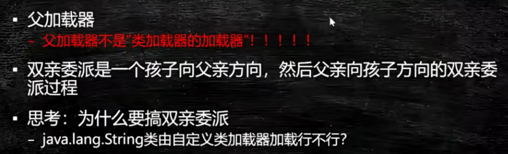

# JVM

## jvm入门

java从编码到执行的过程。我们有一个文件x.java，你执行java c。它就变会变成x.class。当我们调用JAVA命令的时候，class会被load到内存里。一般的情况下我们写自己的类文件的时候也会用到JAVA的类库，所以呢，他会把JAVA类库相关的这些个类也要装载到内存里。装载完成之后呢？会调用字节码的解释器。或者是及时编译器来进行解释，编译完之后由执行引擎开始执行，执行引擎面对的那就是操作系统和硬件了。

会有一个问题，说JAVA是这个解释执行的还是编译执行的？其实呢，解释和编译是可以混合的，特别常用的一些代码，代码用到的次数特别多，好这个时候JIT会把代码做一个即时的编译，做成一个本地的编译，就像你可以理解为就像C语言，只要在WINDOWS上执行的时候把它编译成EXE一样。那么，下次再执行这段代码的时候，就不需要通过解释器来一句一句解释来执行了，执行引擎可以直接交给操作系统去执行，让它的调用效率要高很多，不是所有的代码都要都会被JIT进行及时编译的。如果是这样的话，那整个JAVA就完全变成了不能跨平台了。


JVM我们可以称它是一个跨语言的平台，而JAVA叫跨平台的语言。目前能够在JVM上跑的语言特别多，除了JAVA之外，还有scala、kotlin等等。其实JVM本身也是一个规范。在linux上是由linux实现、WINDOWS由WINDOWS实现、mac由mac实现，它帮你屏蔽了操作系统的这些底层。


那虚拟机到底是怎么够做到这么多语言都可以在上跑呢，最关键的原因是就是因为class这个东西。我们可以说任何的语言，只要你能编译成class，符合class文件的规范，你就可以扔在JAVA虚拟机上去执行。

- jvm和java无关


jvm是一种规范。它是虚构出来的一台计算机，既然它是一个虚拟的计算机，你就可以想象成一层单独的机器，它有自己的CPU，有自己的指令集，有自己的汇编语言，我们后面会讲JAVA的汇编语言，就是字节码的指令集。它是一台虚拟的机器，它就相当于自己是一个操作系统，那自己这个操作系统内存是怎么管理的？我们后面会讲。

这里面就会涉及到编译原理的过程，源码是怎么进行词法分析、语法分析，语义分析、最后生成二进制字节码。这里涉及到编译原理，不会重点说。


JVM是一种规范，既然是一种规范，它就有具体的各种各样的实现。


JVM它只是来执行的，就是你所有东西都弄好了之后让我来执行。你直接直接把.CLASS的各种的东西全部弄好了，扔给它，它来执行，它就干这事。

jre叫java runtime environment，运行时环境。想在操作系统上运行，除了有虚拟机之外你还得有那些核心类库，例如String.class文件


## class文件格式

整个的虚拟机是以class文件为核心，今天我们来分析class文件。

下去一定要写这种特别简单的小程序来进行测试。

```
public class Code01 {
    public static void main(String[] args) {
    }
}
```

反编译。发现自动帮我们加了一个无参构造

```
public class Code01 {
    public Code01() {
    }

    public static void main(String[] args) {
    }
}
```

使用notepad可以看.class字节码文件

```
使用Notepad++查看class文件
notepad++查看class文件需要下载HEX-Editor插件
打开插件管理，搜索HEX-Editor，版本号为0.9.5
安装之后就可以查看字节码文件了。
打开要查看的class文件，按快捷键 Ctrl+Alt+Shift+H 用16进制的方法查看。
```

前面4个字节是魔数。再下来4个字节是小版本号和大版本号。

这就是这样就八个字节了。接下来就是一些常量池有关的，有两个字节代表常量池计数。接下来就是一些常量池具体的内容了。


还有别的可以查看.class字节码文件的方法。

- javap--jdk自带的
- JBE--除了可以观察，还可以修改。
- JClassLib -IDEA插件

到idea里面安装好插件JClassLib。视图里面点击`SHOW BYTECODE WITH JCLASSLIB`。如果是点击了下面的`显示字节码`，那么那个就是用javap帮你解析的


access flag--访问标志位，用两个字节就够了，用按位与运算来知道。

常量池计数有20个，但是常量池只有19个。这是因为常量池是从1开始计数的。要把0保留，标记没有任务引用的情况。

常量池里面的常量类型特别多。CONSTANT_Uft8_info是用的最多的。代表utf 8的一个字符串。

|  |  |
| ------------------------------------------------------------ | ------------------------------------------------------------ |


怎么看常量类型的类别？任意一个常量类型的都是由一个字节开头的，作为tag。然后后面对应有它这个类别应该占多少的空间，这些空间来放值、索引等等。

我们知道前八个字节是魔数和版本号。从第8列开始代表的就是常量池有关的内容了。8-9列，00 14代表常量池计数，1*16+4=20，看上面的图刚好常量池类型标号到了19，为常量池计数-1，因为0位置要留着。

看a列，是第一个常量池类型的tag，发现是10在上图中点进去查看，发现是CONSTANT_Methodref_info的tag，也与上面的相符合。后面还有两个都是2字节的索引项`00 02` 以及`00 03`，分别指向CONSTANT_Class_info和CONSTANT_NameAndType_info。看b-c列和d-e列分别是2号和3号，在下图中也得到了验证！


方法的附加属性最重要的一项是Code。而这个代码具体在最后一项attribute里面。附加属性里面最重要的一项是方法表，也就是这个方法编译完成之后的字节码指令。那么JVM看到这个指令的时候，首先会读这个指令进来，然后他根据指令去查他自己的指令表。

比如拿`aload_0`来说，只要你不是静态方法，永远他都会把这个this扔到操作数栈里，操作栈再执行第二条指令，第二条指令叫invoke special---特殊调用，调用this的构造方法。

看下面字节码。当他读到2a的时候，他知道这个指令叫aload_0。代表把this压栈。然后后面是调用下条指令b7，叫invoke special。而invoke special是需要的参数就是后面的`00 01`。`00 01`代表常量池里面的第一项是JAVA.lang.Object.，调用了他的构造方法。最后一个b1代表return。这也印证了要构造子类先构造父类！


JAVA的指令集用一个字节来代表，所以总共最多就有个256条指令

读下面的方法的字节码。你能大概读出构造过程是怎么构造的。一个对象出来之后，这个构造过程首先会调用父类的构造方法，然后才会把自己的成员变量进行初始化。

```
public class Code02 {
    int a = 888;

    public Code02() {
    }
}
```


再来看。发现变成类字段之后就不在构造方法中进行赋值了！

```java
public class Code03 {
    static int a = 888;

    public Code03() {
    }
}
```


CPU它又会把数据直接拿到它自己内部的寄存器里，速度快多了。但是像JVM的这个设计呢，它是把所有的内容都要经过栈，来进行计算和实现。


常量池后面跟两个字节是access flags，访问标记，代表你这个类前面是private还是public。

继续跟两个字节，这两个字节代表this class，当前类。常量池关键就关键在于后面的所有东西都是去引用它的，所以this class 指向常量池的类名的那个引用。

再往后两个字节是superclass。

再往后两个字节是interface count，就是我这个类到底实现了多少个接口。

后面就是一个一个的interface的引用，都是两个字节，仍然指向常量池的引用。

往后就是fields_count。以及一个一个具体的field。

往后还有methods_count。以及一个一个具体的method_info

最后一项是attribute_count。以及一个一个具体的attribute。这里面最重要的属性其实是code。

## Class Loading Linking Initializing

类的加载、初始化

### 加载过程

加载过程分为三步Loading、Linking、Initializing。

Loding就是把一个一个的class文件load到内存。

Linking还有三小步：

1. verification代表校验。校验你给我装进来的这个class文件符不符合class文件的标准。
2. preparation是最重要的一步。它把文件的静态变量赋默认值(null 0 false)，而不是赋初值，要区分开。
3. resolution意思是这个class文件里面的常量池里面用到的那些符号引用，要给他转换成为直接的内存地址。

Initializing是静态变量的赋值，这个时候才赋为初始值，才调用静态代码块。


来看类加载器。

JVM本身有一个类加载器的层次，分别加载不同的class。jvm里面所有的class都是被类加载器给加载到内存的，class Loader本身也是一个类。

String.class是一个Class类的对象。当一个class文件被load到内存的时候，内存里面创建了两块内容，第一块就是class文件的具体内容。第二块就是一个String.class这样的一个Class类的对象，这个对象指向了前面创建的第一块的内容。后面我们创建的所有的String类型的对象都是先去访问String.class这个对象，通过这个对象去访问String类里面的内容。Class类的对象是c++代码在load的过程中弄出来的。Class类的对象是来帮助我们解析内存里面的二进制码class文件的。

加载过程呢分成不同的层次来加载，不同的加载器负责加载不同的class。

最顶层的是Bootstrap，加载的是核心类，C++实现的。如果你getClassLoader得到的是控制，那么说明你到达了最顶层的类加载器了。Bootstrap它本身是JAVA虚拟机内部用C++代码实现的一个模块，在JAVA里面直接访问是没有一个class和他去直接对应的。因此当我们getClassLoader到头的时候，返回null。

接下来是扩展类加载器。

还有一个是我们自己平时在用到的类加载器，叫做APP类加载器，他是用来加载class path指定的内容。我们自己写的class文件都是位于classpath里面，是由这个类加载器加载的。

加载器的加载器是最顶级的加载器load进来的，而不是加载器的父load进来的，不要混淆！

还有自定义classLoader，后面说。

```java
public class T002_ClassLoaderLevel {
    public static void main(String[] args) {
        //核心
        System.out.println(String.class.getClassLoader());
        //核心
        System.out.println(sun.awt.HKSCS.class.getClassLoader());
        //ext
        System.out.println(sun.net.spi.nameservice.dns.DNSNameService.class.getClassLoader());
        //App
        System.out.println(T002_ClassLoaderLevel.class.getClassLoader());
        //顶级
        System.out.println(sun.net.spi.nameservice.dns.DNSNameService.class.
                         getClassLoader().getClass().getClassLoader());
        //顶级
        System.out.println(T002_ClassLoaderLevel.class.
                           getClassLoader().getClass().getClassLoader());

        System.out.println(new T006_MSBClassLoader().getParent());
        
        System.out.println(ClassLoader.getSystemClassLoader());
    }
}
```

```
null
null
sun.misc.Launcher$ExtClassLoader@677327b6
sun.misc.Launcher$AppClassLoader@18b4aac2
null
null
sun.misc.Launcher$AppClassLoader@18b4aac2
sun.misc.Launcher$AppClassLoader@18b4aac2
```


这里是父，是语法上的父，也就是继承关系（extends）。但是上面那个图说的父并不是继承关系。App/Extension这几个类加载器不是继承关系。下面这个图你完全可以忘掉。真正的我们去load的class文件的时候，上图的意思是说，下面的类加载器如果找不着，我可以委托给我的父加载器去找，这里的父指的是它的上级，而不是指继承。


双亲委派是什么？

一个class文件需要被漏到内存的时候，执行的过程是这样的。假如你自定义了，就先尝试着去自定义Class Loader里面去找。自定义Class Loader内部维护着一个缓存，如果你需要的自定义的S类之前加载过了，那么就不需要再加载一遍了。如果没加载过，会一层层的往上去委托父亲，看看App Class Loader没有加载过，有就返回，没有就继续委托Extension Class Loader、Bootstrap Class Loader。如果到了Bootstrap Class Loader还是没有，那么Bootstrap Class Loader会往下去返回，告诉Extension Class Loader自己去加载，如果Extension Class Loader也加载不了，那么告诉App Class Loader，让它自己去加载，如果App Class Loader也找不到，那么就叫 Custom Class Loader自己去找，这个时候才去加载S类。这是一个转一圈的过程。

如果最后Custom Class Loader成功把S类加载进来了，那么就是成功，否则抛异常，class not found 。这就是双亲委派。



大体的流程。

双亲委派指的是，有一个从子到父的过程，又有一个从父到子的过程。

为什么要有双亲委派？为啥不能直接Load到内存。主要是为了安全。因为如果Custom Class Loader可以把我们自己写的Java.lang.String这个类给Load到内存，那么就会覆盖String这个顶级的核心类，这样我们就可以用自己写的String做坏事，例如偷密码。这是不被允许的。次要问题才是资源浪费问题。

要注意区分概念，父加载器不是类加载器的加载器，这个父的意思是我们画的那个委派的层次图。Custom Class Loader委托自己的上级App Class Loader去找，App Class Loader就是Custom Class Loader的父。而类加载器的加载器是Bootstrap Class Loader去加载的。并且这里的父的意思，也不是父类extends的意思，Custom Class Loader并不是App Class Loader的子类！

从源码级别理解父加载器，其实一个 Class Loader里面有一个成员变量叫做parent，这个parent你指定谁，谁就是你的父加载器。


```java
public class T004_ParentAndChild {
    public static void main(String[] args) {
        System.out.println(T004_ParentAndChild.class.getClassLoader());//App
        System.out.println(T004_ParentAndChild.class.getClassLoader().//App
                getClass().getClassLoader());//BootStrap
        System.out.println(T004_ParentAndChild.class.getClassLoader().//App
                getParent());//Extension
        System.out.println(T004_ParentAndChild.class.getClassLoader().//App
                getParent().//Extension
                getParent());//BootStrap
    }
}
```

输出：

一个对象的的toString方法，它默认显示类的名字+Hashcode。所以这个类的名字是sun.misc.Launcher$AppClassLoader，也就是说AppClassLoader是Launcher的一个内部类。Launcher其实就是AppClassLoader的一个包装类，一个启动类。看Launcher的源码你会发现，APP、BootStrap、Extension加载器加载的路径都在里面写死了。

```
sun.misc.Launcher$AppClassLoader@18b4aac2
null
sun.misc.Launcher$ExtClassLoader@1b6d3586
null
```


下面看怎么自定义类类加载器。

你要加载一个类很简单，你只需要调用class loader的load class方法就能够把这个类加载到内存，与此同时，生成一个Class类的对象，把这个class对象返回给你。所以class loader能帮你干很多事情，能够帮你去加载各种各样的东西，例如图片资源。

- 和反射的联系：class loader是反射的一个基石，你平时用的所谓的反射，无非就是你用class类的这个对象去访问二进制代码

- 什么时候我们需要去加载一个类？springmvc说过，会把某一个Class给你生成一个动态代理，这个动态代理是一个新的Class。当你要用的时候，实际上spring偷偷的把这个新的class给你load到内存了。

  以及还有热部署，怎么热替换？我肯定需要一个class loader把这个新的Class手动的Load到内存里面去

```java
Class clazz = T005_LoadClassByHand.class.getClassLoader().//拿到AppClassLoader
    loadClass("com.mashibing.jvm.c2_classloader.T002_ClassLoaderLevel");
```

接下来看看.getClassLoader()方法核心的执行逻辑。可以看到先检查是不是已经Load进来了，如果没有load进来，加锁去load。先调用父亲的loadClass方法，类似一个递归的调用，回想双亲委派的过程。接着往下，也就是去父加载器找完了，看看是不是找到了，如果没有找到，那么就只能自己亲自去找了，自己找，这里调用了findClass(name)。这里相当于没有实现，意思就是如果我的Bootstrap Class Loader、App Class Loader、Custom Class Loader都没有找到，来到这段代码了，直接抛异常。所以如果我们要写自定义的类加载器，我们就自己去实现这个方法。

这个设计模式是钩子函数模板方法。

```java
protected Class<?> findClass(String name) throws ClassNotFoundException {
    throw new ClassNotFoundException(name);
}
```

```java
protected Class<?> loadClass(String name, boolean resolve)
    throws ClassNotFoundException
{
    synchronized (getClassLoadingLock(name)) {
        // First, check if the class has already been loaded
        Class<?> c = findLoadedClass(name);
        if (c == null) {
            long t0 = System.nanoTime();
            try {
                if (parent != null) {
                    c = parent.loadClass(name, false);
                } else {
                    c = findBootstrapClassOrNull(name);
                }
            } catch (ClassNotFoundException e) {
                // ClassNotFoundException thrown if class not found
                // from the non-null parent class loader
            }

            if (c == null) {
                // If still not found, then invoke findClass in order
                // to find the class.
                long t1 = System.nanoTime();
                c = findClass(name);

                // this is the defining class loader; record the stats
                sun.misc.PerfCounter.getParentDelegationTime().addTime(t1 - t0);
                sun.misc.PerfCounter.getFindClassTime().addElapsedTimeFrom(t1);
                sun.misc.PerfCounter.getFindClasses().increment();
            }
        }
        if (resolve) {
            resolveClass(c);
        }
        return c;
    }
}
```

所以如果我们需要自定义Class Loader，我们只需要定义自己的findCLass方法即可。


具体像下面这样重写findClass方法。defineClass是一个自带的方法，自己用，可以把你读进来的字节数组转化为一个Class。

```java
public class T006_MSBClassLoader extends ClassLoader {

    @Override
    protected Class<?> findClass(String name) throws ClassNotFoundException {
        File f = new File("c:/test/", name.replace(".", "/").concat(".class"));
        try {
            FileInputStream fis = new FileInputStream(f);
            ByteArrayOutputStream baos = new ByteArrayOutputStream();
            int b = 0;

            while ((b=fis.read()) !=0) {
                baos.write(b);
            }

            byte[] bytes = baos.toByteArray();
            baos.close();
            fis.close();//可以写的更加严谨

            return defineClass(name, bytes, 0, bytes.length);
        } catch (Exception e) {
            e.printStackTrace();
        }
        return super.findClass(name); //throws ClassNotFoundException
    }

    public static void main(String[] args) throws Exception {
        ClassLoader l = new T006_MSBClassLoader();
        Class clazz = l.loadClass("com.mashibing.jvm.Hello");
        Class clazz1 = l.loadClass("com.mashibing.jvm.Hello");

        System.out.println(clazz == clazz1);

        Hello h = (Hello)clazz.newInstance();
        h.m();

        System.out.println(l.getClass().getClassLoader());
        System.out.println(l.getParent());

        System.out.println(getSystemClassLoader());
    }
}
```

大家知道的java代码文件很容易就被反编译了。我不想让别人反编译，我就可以定义自己的格式，定义自己的ClassLoader，把一个加密过的class文件读进来，然后自己去解密。别人没有你这个ClassLoader，是没有办法解密的。

再来看懒初始化、懒加载。多数的jvm虚拟机的实现都是用的懒加载，意思就是什么时候需要这个类的时候我才去加载。


验证上面的。只有加载了才会在Initializing的时候执行静态语句块。

```JAVA
public class T008_LazyLoading { //严格讲应该叫lazy initialzing，因为java虚拟机规范并没有严格规定什么时候必须loading,但严格规定了什么时候initialzing
    public static void main(String[] args) throws Exception {
//        P p;//不会打印，我没有new，不会加载
//        X x = new X();//P是X的父类，x new了，所以X被加载，那么P作为父类也会加载
//        System.out.println(P.i);//final，不需要加载
//        System.out.println(P.j);//需要加载
//        Class.forName("com.mashibing.jvm.c2_classloader.T008_LazyLoading$P");//需要加载

    }

    public static class P {
        final static int i = 8;
        static int j = 9;
        static {
            System.out.println("P");
        }
    }

    public static class X extends P {
        static {
            System.out.println("X");
        }
    }
}
```

来看编译的问题。

JAVA是解释执行的。一个class文件load到内存之后它通过JAVA的解释器来执行。JAVA其实有一个JIT，just in time compiler。指的是有某些代码我需要把它编译成为本地代码，相当于是.EXE的。java是一种混合模式，使用解释器，再加上热点代码编译，这两种方式同时进行。热点代码是什么？意思就是虚拟机一开始都是解释执行，但是后面发现这段代码就是一个普通的循环，而且使用频率特别高，就会把它编译称为本地代码。

那为什么不直接全部变成本地代码呢？因为java解释器现在效率也很高了，在一些简单代码的执行上，它并不输于你编译成本地代码。第二，如果你一个执行的文件特别特别多，各种各样的类好几十个，你如果是变成本地代码，那么你启动会很慢。


#### 1. Loading

Loding分为下面的五个小步骤。


1. 双亲委派，主要出于安全来考虑

2. LazyLoading 五种情况

   1. –new getstatic putstatic invokestatic指令，访问final变量除外

      –java.lang.reflect对类进行反射调用时

      –初始化子类的时候，父类首先初始化

      –虚拟机启动时，被执行的主类必须初始化

      –动态语言支持java.lang.invoke.MethodHandle解析的结果为REF_getstatic REF_putstatic REF_invokestatic的方法句柄时，该类必须初始化

3. ClassLoader的源码

   1. findInCache -> parent.loadClass -> findClass()

4. 自定义类加载器

   1. extends ClassLoader
   2. overwrite findClass() -> defineClass(byte[] -> Class clazz)
   3. 加密
   4. <font color=red>第一节课遗留问题：parent是如何指定的，打破双亲委派，学生问题桌面图片</font>
      1. 用super(parent)指定
      2. 双亲委派的打破
         1. 如何打破：重写loadClass（）
         2. 何时打破过？
            1. JDK1.2之前，自定义ClassLoader都必须重写loadClass()
            2. ThreadContextClassLoader可以实现基础类调用实现类代码，通过thread.setContextClassLoader指定
            3. 热启动，热部署
               1. osgi tomcat 都有自己的模块指定classloader（可以加载同一类库的不同版本）

5. 混合执行 编译执行 解释执行

   1. 检测热点代码：-XX:CompileThreshold = 10000

#### 2. Linking 

1. Verification
   1. 验证文件是否符合JVM规定
2. Preparation
   1. 静态成员变量赋默认值
3. Resolution
   1. 将类、方法、属性等符号引用解析为直接引用
      常量池中的各种符号引用解析为指针、偏移量等内存地址的直接引用

#### 3. Initializing

1. 调用类初始化代码 <clinit>，给静态成员变量赋初始值

### 小总结

1. load - 默认值 - 初始值
2. new - 申请内存 - 默认值 - 初始值


## Object的内存布局

观察虚拟机的配置(cmd)：`java -XX:+PrintCommandLineFlags -version`

InitialHeapSize:初始的堆大小

MaxHeapSize：最大的堆大小

UseCompressedClassPointers：把指针压缩打开会把对象指针变为4字节，否则就是8字节。

UseCompressedOops：普通的对象的指针压缩了，把对象指针变为4字节，否则就是8字节


```
C:\Users\86187>java -XX:+PrintCommandLineFlags -version
-XX:ConcGCThreads=3 -XX:G1ConcRefinementThreads=13 -XX:GCDrainStackTargetSize=64 -XX:InitialHeapSize=266011584 -XX:MarkStackSize=4194304 -XX:MaxHeapSize=4256185344 -XX:MinHeapSize=6815736 -XX:+PrintCommandLineFlags -XX:ReservedCodeCacheSize=251658240 -XX:+SegmentedCodeCache -XX:+UseCompressedClassPointers -XX:+UseCompressedOops -XX:+UseG1GC -XX:-UseLargePagesIndividualAllocation
openjdk version "17.0.2" 2022-01-18
OpenJDK Runtime Environment (build 17.0.2+8-86)
OpenJDK 64-Bit Server VM (build 17.0.2+8-86, mixed mode, sharing)
```


### 对象的创建过程

1. 把class加载到内存

2. verification：校验

   preparation：把那个类的静态变量设默认值

   resolution：做一个解析。

3. 把静态变量设置为初始值，同时执行静态语句块。

4. 把对象需要的内存申请下来

5. 成员变量赋默认值。

6. 成员变量赋初始值，也就是一开始private int a = 1。然后执行构造方法，先执行父类的构造方法，然后执行自己的构造方法。


### 对象在内存中的存储布局

这个对象的大小跟具体虚拟机的实现以及虚拟机的设置都很有关系。

#### 普通对象

1. 对象头：markword  8 bytes
2. ClassPointer指针：-XX:+UseCompressedClassPointers 为4字节 不开启为8字节。这个指针指向T.class
3. 实例数据（成员变量）
   1. 引用类型：-XX:+UseCompressedOops 为4字节 不开启为8字节 
      Oops Ordinary Object Pointers
4. Padding对齐，8 bytes的倍数

#### 数组对象

1. 对象头：markword 8 bytes
2. ClassPointer指针同上4字节。代表这个数组装的哪种类型。
3. 数组长度：4字节
4. 数组数据
5. 对齐 8的倍数

我们知道T.class会被虚拟机load进内存，那么agent是一个代理，可以在load进内存的时候截获这个T.class，进而就知道这个对象的大小了。这个代理可以做任意的事情，可以修改里面的值。这个Agent需要我们自己去实现，实现完之后打成一个Jar包，然后在需要用到这个Agent的项目中引入这个Jar包。

这个可以用来验证大小。

#### 小实验

1. 新建项目ObjectSize （1.8）

2. 创建文件ObjectSizeAgent

   ```java
   package com.mashibing.jvm.agent;
   
   import java.lang.instrument.Instrumentation;
   
   public class ObjectSizeAgent {
       private static Instrumentation inst;
   
       public static void premain(String agentArgs, Instrumentation _inst) {
           inst = _inst;
       }
   
       public static long sizeOf(Object o) {
           return inst.getObjectSize(o);
       }
   }
   ```

3. src目录下创建META-INF/MANIFEST.MF

   ```java
   Manifest-Version: 1.0
   Created-By: mashibing.com
   Premain-Class: com.mashibing.jvm.agent.ObjectSizeAgent
   ```

   注意Premain-Class这行必须是新的一行（回车 + 换行），确认idea不能有任何错误提示

4. 打包jar文件

5. 在需要使用该Agent Jar的项目中引入该Jar包
   project structure - project settings - library 添加该jar包

6. 运行时需要该Agent Jar的类，加入参数：

   ```java
   -javaagent:C:\work\ijprojects\ObjectSize\out\artifacts\ObjectSize_jar\ObjectSize.jar
   ```

7. 如何使用该类：

   ```java
   ```java
      package com.mashibing.jvm.c3_jmm;
      
      import com.mashibing.jvm.agent.ObjectSizeAgent;
      
      public class T03_SizeOfAnObject {
          public static void main(String[] args) {
              System.out.println(ObjectSizeAgent.sizeOf(new Object()));
              System.out.println(ObjectSizeAgent.sizeOf(new int[] {}));
              System.out.println(ObjectSizeAgent.sizeOf(new P()));
          }
      
          private static class P {
                              //8 _markword
                              //4 _oop指针
              int id;         //4
              String name;    //4
              int age;        //4
      
              byte b1;        //1
              byte b2;        //1
      
              Object o;       //4
              byte b3;        //1
      
          }
      }
   ```

### 对象头具体包括什么


对象头记录的就是一些状态信息。

在没锁的情况下你得看锁的标志位是不是偏向了。

hashcode分为两种情况，第一种叫做你重写过，第二种叫你没重写过。没重写过，就是默认的根据后面的内存的布局给你计算一个。这个hashcode称之为identity hash code。

可以看到hashcode和位置和偏向锁前面的线程id以及epoch是重的。那么如果一个对象计算过hashcode，就无法进入偏向锁的状态。

```
identity hash code 问题去下面网站看
https://cloud.tencent.com/developer/article/1480590
https://cloud.tencent.com/developer/article/1484167
https://cloud.tencent.com/developer/article/1485795
https://cloud.tencent.com/developer/article/1482500
```


### 对象定位

`https://blog.csdn.net/clover_lily/article/details/80095580`

1. 句柄池
2. 直接指针

第一种是一个间接指针的方式，先找到中间的那个指针，中间的那个指针分出两个，一个指向T.class一个指向对象。

HotSpot的实现是第二种。t指针直接指向那个new出来的具体对象，然后通过对象里面的类型指针找到T.class。

但是第一种，在后面垃圾回收的时候可能会效率比较高。


### 对象如何分配

- 是和GC有关的内容，后面说


