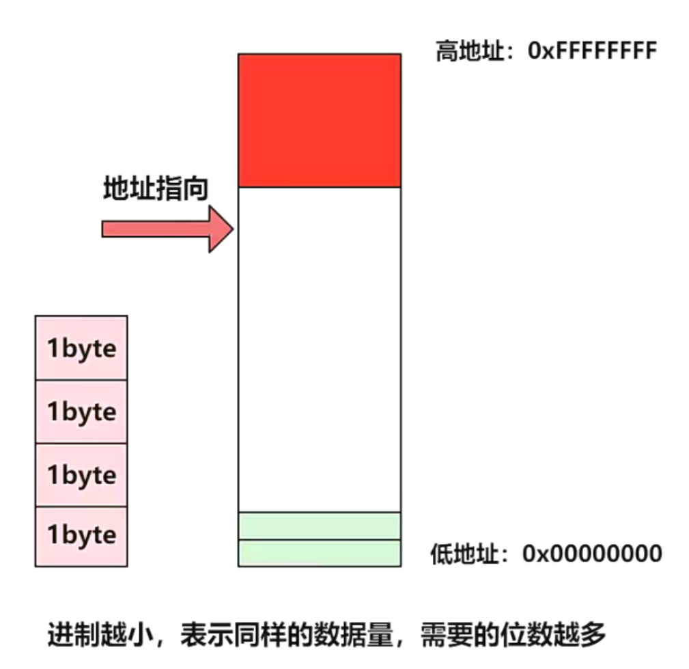
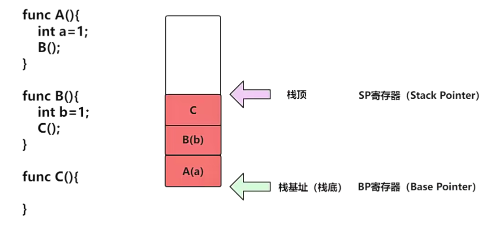
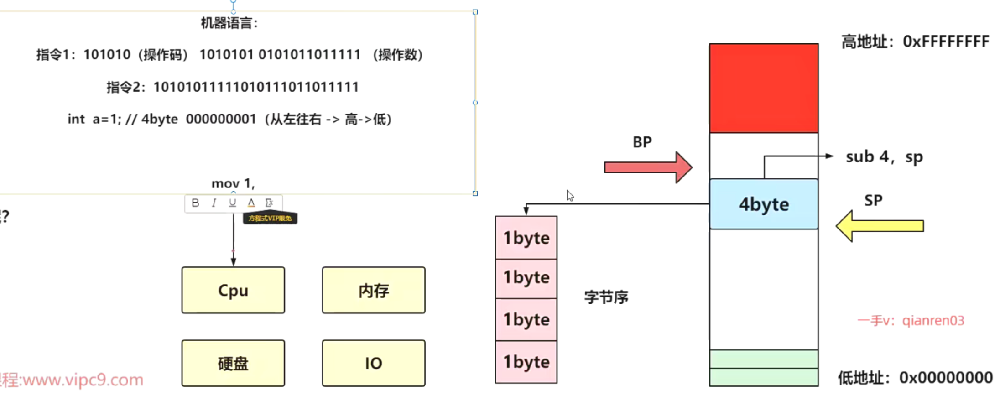
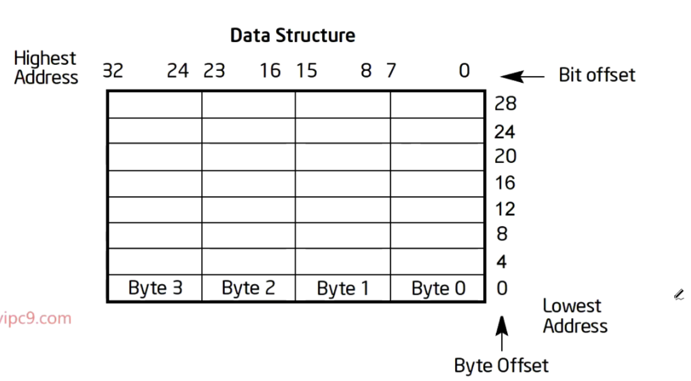
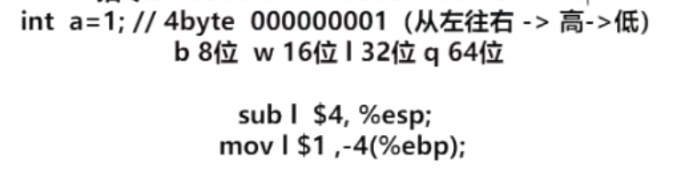
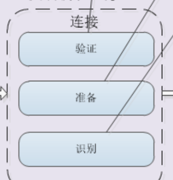

# 2022JVM

## 汇编

内存空间如下图。我们在分配一个int所需的4byte空间的时候我们应该从上往下分配还是从下往上分配呢？答案是从上往下，因为从下往上如果越过了**红线**会导致系统奔溃！高地址是内核的地址。所以有两种方式，一种是从底下，从远离红线的地方开始分配，一个是从靠近红线的地方往下分配。

函数调用的压栈过程。

一开始栈为空，bp和sp应该相等。如果我们要往下扩展，sp往下走相当于扩展出了一片内存空间。我们的sub汇编语言就可以操作这一片内存空间。拿000000....1的高低，和内存的地址的高低做对应。拿0000...1的低地址到内存的低地址就是小端序，拿0000...1的高地址0000到内存的低地址就是小端序。

总结说：字节序就是拿二进制的高和低对应到内存地址的高和低。如果高低吻合就是小端序，否则就是大端序。

举例来说，sp指针减4来扩充了空间，比如扩充了int a=1的空间。我们应该把1放在高位还是低位呢？存在低就是小端序，存在高就是大端序。

Intel的小端序

int a=1在底层是这样的：把esp（32位的sp）往下移动4bite，然后把1数据移动到esp中。

在sub指令的后面要加上要操作数的长度。 规定寄存器前面加上百分号。并且数值前面要加上$。 

1. 最开始出现的语言是机器语言，它是由二进制组成，即：010101。机器语言直接与CPU沟通，但是由于需要程序员编
   写需要记住大量的指令0101组成，而且不小心写错了的话，就找不到写错的地方，所以引入了汇编语言。在这研究的
   时候，我们只需要知道，一个指令由两部分组成：操作码+操作数。
2. 进制越小，表示同样的数据量，需要的位数越多
3. 内存扩张方向，可以自上而下，也可以自下而上
4. 字节序用于规定数据在内存单元中如何存放，intel用的小端序
5. 方法调用等于入栈出栈的过程，满足先进后出
6. 汇编中用sp寄存器和bp寄存器用于保存栈顶和栈底
7. 16位机中sp为16，esp为32，rsp为64位

jvm是一个模拟了cpu运行的东西。什么是虚拟机？它虚拟了一个机器。

## 第二节

什么是类和对象？类就描述了你对象的轮廓。 你对象在内存里面就应该按照类文件规定的去长，要长得一模一样才行。不能说我类是一个男人，你给我一个女性。类装载子系统只需要把我们的这个字节码加载进来。 放到某一个地方。但是在装载的时候，你的类文件是不是得给我解析解析? 验证验证? 

然后所以呢我们就做做出了这么一个东西。 需要加载验证准备识别。字节点码里边是不是有静态变量？静态变量是不是用static来描述的？假如我写了一个static int a，这个值JVM会给初始值。假如赋值了10。那么这个静态变量的值保存在哪？在指令里面。

当静态变量为整形值时，在clinit中对其进行初始化，整形值将会放在字节码中，然后通过操作数栈来保存。当我们用float、 double、对象时，那么将会放入常量池中，在运行的时候通过ldc指令，将他们的地址放入操作数栈来操作。